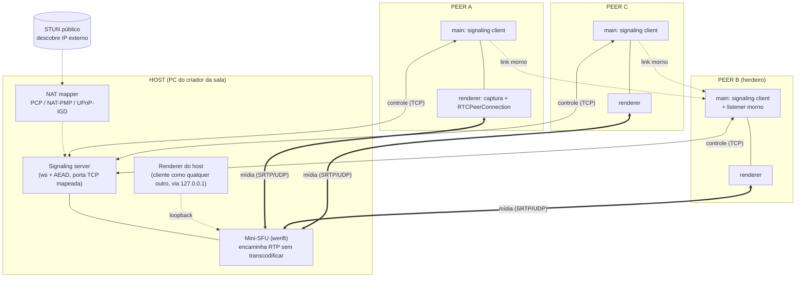
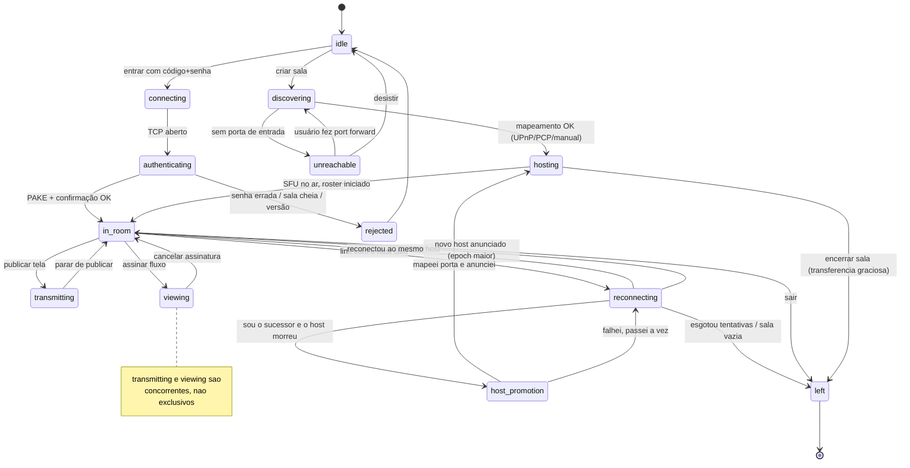
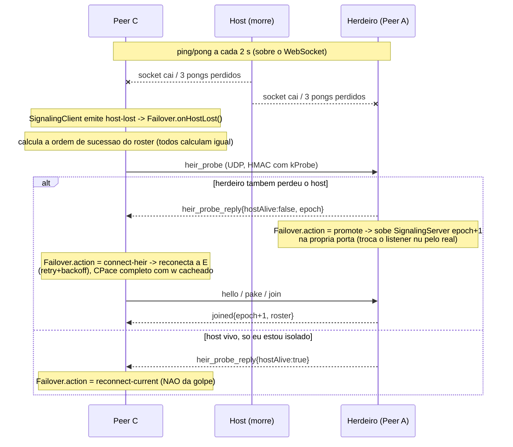

# Design Doc — `erros-share`
### Compartilhamento de tela P2P multi-transmissor, sem infraestrutura própria

| | |
|---|---|
| **Versão** | 0.3 — Fases 0, 1 e 2 concluídas |
| **Alvo** | Windows 11 x64 |
| **Stack** | Electron + WebRTC (Chromium) + WebRTC nativo em Node (werift) |
| **Escala** | até 12 participantes por sala |
| **Status** | plano de controle + failover funcionando e testados; **próximo: Fase 3 (mídia)** |

> Documentação e UI em pt-BR. Código, identificadores, campos de protocolo e comentários em inglês.

---

## 0. Estado da implementação (leia primeiro numa nova sessão)

**Fases 0, 1, 2 concluídas. Fase 3 em andamento — checkpoints 3.1 (shell), 3.2 (captura), 3.3 (SFU), 3.4 (encaminhamento seletivo) e 3.5 (governor de qualidade) prontos.**

**O que já existe e passa nos testes** (`npm test` → 135 testes, 20 arquivos; `npm run typecheck` limpo — Node + web; `npm audit` → 0 vulnerabilidades):

| Área | Módulos | Status |
|---|---|---|
| Cripto | `src/main/crypto/{lv,kdf,cpace,aead}.ts` | CPace ristretto255/SHA-512 **verificado contra o vetor de teste do CFRG**; Argon2id 64 MiB; AES-256-GCM |
| Frames | `src/main/net/{connection,frame-codec}.ts` | enquadramento autenticado, contador anti-replay, fila para corrida texto→binário |
| Código de sala | `src/main/room/{base32,ip,room-code,host-endpoint}.ts` | Base32 Crockford + CRC-16, IPv4/IPv6, orquestrador STUN+NAT→código |
| NAT | `src/main/net/{stun,nat-mapping,local-ip,reachability}.ts` | STUN **implementado à mão** (validado contra o Google); UPnP/PMP/PCP via `@achingbrain/nat-port-mapper`; CGNAT detectado |
| Sinalização | `src/main/signaling/{server,client,handshake,roster,rate-limit,heartbeat}.ts` | `SignalingServer` (host) + `SignalingClient` (peer); admissão por senha; rate limit por IP; heartbeat ping/pong |
| Failover | `src/main/election/{succession,failover}.ts`, `src/main/net/heir-probe.ts`, `src/main/signaling/peer-node.ts` | ordem de sucessão determinística; `heir_probe` UDP autenticado por `w`; `Failover` (promote / re-home / reconnect / room-dead); `PeerNode` (participante completo); `host_transfer` gracioso |
| Protocolo | `src/shared/protocol.ts` | todas as mensagens em `zod`; `epoch` no envelope e no `joined` |
| **App shell (3.1)** | `src/main/index.ts`, `src/main/app/{room-session,ipc}.ts`, `src/preload/index.ts`, `src/renderer/` | Electron + React (pt-BR); `RoomSession` (criar/entrar, une host↔peer); IPC tipado por `window.erros`; lobby + tela de sala com roster ao vivo, código, status de rede. `npm run dev` sobe tudo |
| **Captura local (3.2)** | `src/main/app/capture.ts`, `src/renderer/src/{capture.ts,CapturePanel.tsx}` | listar telas/janelas com thumbnail, `setDisplayMediaRequestHandler` com áudio de sistema (`audio: 'loopback'`), prévia local em `<video>` |
| **SFU + mídia (3.3–3.5)** | `src/main/sfu/{router,codecs,media-plane,governor}.ts`, `src/renderer/src/{rtc.ts,StreamsPanel.tsx}` | mini-SFU werift no `main`: 1 PC por publisher, 1 por (assinante×stream); encaminha RTP sem transcodificar; PLI ao primeiro pacote. Negociação **non-trickle**. Encaminhamento seletivo (`demand-changed` → pausa/retoma o encoder do dono). **Governor**: escada de 4 níveis, `stats_report` (perda/CPU) a cada 4 s, `quality_directive` com `scaleDownBy`. Renderer `useMedia()`: publica, assina múltiplos streams, aplica directive no `RTCRtpSender`, manda stats, expõe `publishIdle`/`watching`. **werift↔werift testado** (`test/sfu/{router,media-plane,governor}.test.ts`); **werift↔Chromium só valida com o app real** (docs/TESTING-MEDIA.md) |
| Spike | `scripts/spike-sfu-throughput.mts`, `docs/SPIKE-SFU.md` | werift sustenta ~6.200 pkt/s a ~64% de um núcleo (pior caso) |
| Ferramenta | `scripts/check-network.mts` (`npm run check:network`) | roda STUN+NAT+geração de código na rede real |

**O que NÃO existe ainda (o resto da Fase 3):** restaurar publicações/assinaturas após um failover (o `SignalingServer` da promoção é criado sem `media`, então o herdeiro promovido não tem SFU); ICE trickle; teste de campo real werift↔Chromium entre máquinas. `src/main/config/` (settings.json) ainda não existe.

**Toolchain (Fase 3.1):** `electron@44` + `electron-vite@5` (com `vite@7` — fixado porque `electron-vite` ainda não aceita vite 8) + `@vitejs/plugin-react@5` + `react@19`. `werift` agora está em `dependencies`. Dois tsconfig: `tsconfig.json` (Node: main/preload/shared/test) e `tsconfig.web.json` (renderer: DOM + jsx). O preload é forçado a `.cjs` (`electron.vite.config.ts`) porque preload em sandbox precisa ser CommonJS. `src/renderer/vite.config.ts` existe só para rodar o renderer sozinho no browser (`vite src/renderer`, com `?mock` → `src/renderer/src/mock.ts` stub-a o `window.erros`).

**Desvios do design já decididos e implementados** (todos com o OK do usuário):
1. **Plano de controle sobre WebSocket**, não sobre data channel SCTP (§2.2). O heartbeat roda sobre o WebSocket com o host.
2. **`heir_probe` é UDP autenticado por `w`**, não um WebSocket ocioso permanente com o herdeiro (§9.1). Request/reply com HMAC nas duas pontas.
3. **STUN hand-rolled** (`src/main/net/stun.ts`) em vez de um pacote npm (árvore de dependências podre).
4. **`@achingbrain/nat-port-mapper`** em vez de `nat-api` (que puxava `request` descontinuado).
5. **Na promoção, o novo host NÃO roda um cliente próprio** — lê o roster direto do `SignalingServer` (igual ao host da Fase 1). O design menciona "host roda um cliente como qualquer outro"; não foi necessário.
6. **`inboundVerified` é só um TCP connect de volta**, sem o "handshake curto" de prova de identidade ainda. Ver §14, limitação.
7. **O peer deriva `w` de forma eager** em `RoomSession.join` (antes de conectar), usando `argonParams` default. Se um host usar `argonParams` não-default, o peer precisa saber (hoje: só via opção). O caminho correto (derivar após `hello_ack`) existe no `SignalingClient` (`PasswordSource` aceita `{password, codeSalt}`) mas `PeerNode` ainda só aceita `{w}`. TODO da Fase 3/4.

**Decisões pendentes de confirmação:** ver §16 (perguntas em aberto) — codec (VP9 vs H.264), E2EE de mídia (confirmado: **fora da v1**), e a interop werift↔Chromium (só validável com renderer real, no próximo checkpoint).

### Como retomar na Fase 3

O ponto de entrada é o **§17 (Kickoff da Fase 3)** no fim deste documento. Em resumo: adicionar Electron + `electron-vite`, criar o `renderer`, embutir o mini-SFU werift no `SignalingServer` (ou num módulo `src/main/sfu/`), e ligar `RTCPeerConnection` no renderer ↔ SFU no `main`. O plano de controle (mensagens `publish_*` / `subscribe_*` / `quality_directive` / `stats_report`) já está esboçado no §7.3 mas **ainda não implementado** nos schemas `zod` nem no servidor.

---

## 1. Objetivo e escopo

Aplicação desktop onde várias pessoas em **casas e redes diferentes, pela internet, sem VPN** entram numa mesma sala, transmitem a tela simultaneamente e escolhem individualmente quais transmissões assistir.

**Restrição fundadora:** nenhuma infraestrutura mantida pelo usuário. Não existe backend. O executável é idêntico em todos os PCs; quem cria a sala vira o coordenador (`host`) daquela sessão. STUN público é permitido (um pacote UDP, sem mídia). TURN é apenas ponto de extensão opcional.

**No escopo:** captura de tela inteira ou janela + áudio do sistema; múltiplos transmissores; assinatura seletiva de fluxos; failover automático de host; autenticação por código + senha.

**Fora do escopo nesta rodada:** microfone, webcam, gravação, chat com UI, auto-update, macOS/Linux.

---

## 2. Visão geral da arquitetura

Dois planos separados, com requisitos de rede diferentes. Essa separação é a decisão central do design.

| | **Plano de controle** | **Plano de mídia** |
|---|---|---|
| Transporte | WebSocket sobre TCP, com AEAD próprio | WebRTC (ICE/DTLS-SRTP sobre UDP) |
| Topologia | estrela para o host + link morno para o herdeiro | estrela pelo host-SFU |
| Onde roda | processo `main` (Node) | `renderer` (Chromium) nos clientes, `main` (werift) no host |
| Precisa de porta de entrada | **sim, no host e no herdeiro** | não (hole punching por ICE) |
| Volume | ~centenas de bytes/s | Mbps |



### 2.1 Por que o SFU é nativo no `main`, e não no renderer

O caminho "óbvio" seria o renderer do host pegar o `MediaStreamTrack` recebido do peer A e fazer `addTrack` na `RTCPeerConnection` do peer B. **Isso força decodificação + recodificação** por destino: o Chromium não repassa RTP entre `PeerConnection`s. Com 2 transmissores e 11 espectadores, o host precisaria de ~22 encoders 1080p30 simultâneos — inviável em qualquer PC doméstico.

Um SFU de verdade só reescreve cabeçalhos RTP (SSRC, sequência, timestamp) e re-encripta SRTP para cada destino. Custo por pacote, não por frame; **zero encoders**. Para isso precisamos de uma pilha WebRTC que nos dê acesso a RTP, o que o Chromium não expõe. Daí `werift` (WebRTC puro em TypeScript, roda em Node) no processo `main`.

Efeito colateral muito bem-vindo: **o host deixa de ser especial**. O SFU é um módulo Node que qualquer instância pode ligar; o renderer do host conecta ao seu próprio SFU por `127.0.0.1`. O código do cliente é idêntico em host e peer, o que torna o failover uma troca de configuração em vez de uma troca de arquitetura.

### 2.2 Por que WebSocket + AEAD próprio, e não TLS, e não data channel

**Contra TLS:** o host é alcançado por `IP:porta` cru. Não há nome DNS nem CA possível, então só sobra certificado autoassinado — e aí a decisão de confiança fica com o usuário (TOFU, aviso de certificado, ou desabilitar validação, que é pior que não ter TLS). O handshake por senha (§6) já produz um segredo compartilhado **mutuamente autenticado**; derivar as chaves de transporte dele dá confidencialidade, integridade e autenticação *melhores* que TLS-com-certificado-autoassinado, com menos peças. Usamos `ws://` como enquadramento e cifra própria por cima (AES-256-GCM), com o handshake sendo a primeira coisa que acontece no socket.

**Contra data channel SCTP para o controle** (desvio proposto à decisão 4 — ver §16, pergunta 1): o WebSocket com o host tem que existir de qualquer forma para trocar SDP/ICE. Um data channel exigiria, *depois disso*, ICE + DTLS + SCTP para carregar as mesmas mensagens de controle — mais código, mais latência de estabelecimento, e falha exatamente nas mesmas condições de NAT. O heartbeat sobre o WebSocket detecta precisamente o evento que importa (processo ou rede do host desaparecer). Continuamos com data channels reservados para o ponto de extensão de chat (decisão 8), aí sim sobre a mídia.

---

## 3. Processos, módulos e IPC

Estado real da árvore (`✅` = existe e testado, `🔜` = Fase 3+):

```
src/
  shared/
    protocol.ts            ✅ esquemas zod de TODAS as mensagens (+ epoch)
  main/                      # Node — nada de UI
    crypto/
      lv.ts                 ✅ leb128 / lv_cat do CPace
      kdf.ts                ✅ Argon2id + HKDF + derivação de chaves
      cpace.ts              ✅ PAKE ristretto255 (vetor do CFRG)
      aead.ts               ✅ AES-256-GCM
    net/
      connection.ts         ✅ Connection: texto→binário, fila anti-corrida
      frame-codec.ts        ✅ enquadramento + contador anti-replay
      stun.ts               ✅ cliente STUN hand-rolled (Binding Request)
      nat-mapping.ts        ✅ PCP/NAT-PMP/UPnP via @achingbrain/nat-port-mapper
      local-ip.ts           ✅ IP LAN primário
      reachability.ts       ✅ tcpReachable (probe de inboundVerified)
      heir-probe.ts         ✅ heir_probe UDP autenticado por w
    room/
      base32.ts ip.ts       ✅ Base32 Crockford, IPv4/IPv6
      room-code.ts          ✅ encode/decode do código (CRC-16)
      host-endpoint.ts      ✅ orquestra STUN + NAT → RoomCodeData
    signaling/
      handshake.ts          ✅ conduz o CPace nos dois papéis
      server.ts             ✅ SignalingServer (host) + transferHost + crash
      client.ts             ✅ SignalingClient (peer) + epoch + host-lost
      roster.ts             ✅ estado autoritativo do host
      rate-limit.ts         ✅ RateLimiter por IP
      heartbeat.ts          ✅ ping/pong, timer-agnóstico
      peer-node.ts          ✅ participante completo (client + responder + failover)
    election/
      succession.ts         ✅ ordem determinística (puro)
      failover.ts           ✅ coordenador (promote/re-home/reconnect/room-dead)
    sfu/                     🔜 router.ts forwarder.ts governor.ts
    app/                     🔜 lifecycle Electron, janelas, IPC handlers
    config/                  🔜 settings.json (STUN, TURN, porta, teto de fluxos)
  preload/                   🔜 contextBridge tipado
  renderer/                  🔜 React pt-BR: capture/ rtc/ ui/
scripts/
  spike-sfu-throughput.mts   ✅ spike werift (docs/SPIKE-SFU.md)
  check-network.mts          ✅ npm run check:network
```

Segurança do Electron (a valer na Fase 3): `contextIsolation: true`, `nodeIntegration: false`, `sandbox: true` no renderer, CSP restritiva, `preload` expondo só um canal tipado. A rede nunca toca no renderer — tudo entra pelo `main`, é validado com `zod`, e só então vira IPC.

---

## 4. Máquina de estados do participante



`transmitting` e `viewing` são flags sobre `in_room`, não estados exclusivos: dá para transmitir e assistir ao mesmo tempo.

> **Mapeamento para o código (Fases 1–2):** `connecting`/`authenticating` = `SignalingClient.connect()` + `runPeerHandshake`; `in_room` = pós-`joined`; `reconnecting`/`host_promotion` = `Failover` + `PeerNode.#applyAction` (`reconnect-current` / `connect-heir` / `promote`); `hosting` = `PeerNode` com `#isHost = true` rodando um `SignalingServer`. `transmitting`/`viewing` ainda não existem (Fase 3).

---

## 5. Formato do código de sala

O código carrega **onde** está o host e **qual** é a sala. Não carrega segredo nenhum.

```
byte 0      version                 (u8 = 1)
byte 1      flags                   bit0: 0=IPv4 1=IPv6 | bit1: reservado (hostname)
bytes 2-5   roomId                  (4 bytes aleatorios)
bytes 6-11  codeSalt                (6 bytes aleatorios)
bytes 12-13 port                    (u16 big-endian)
bytes 14..  address                 (4 bytes IPv4 | 16 bytes IPv6)
ultimos 2   crc16                   (CCITT, sobre tudo acima)
```

IPv4: corpo de 18 bytes + 2 de CRC = **20 bytes → exatamente 32 caracteres** em Base32 Crockford (maiúsculas, sem `I/L/O/U`), exibidos em grupos de 4. IPv6: 30 + 2 = **32 bytes → 52 caracteres**.

```
K7QM-4X2A-9BTR-0FDW-6HJE-3NCV-8PGY-1SZK
```

Entrada tolerante: normaliza minúsculas, aceita/ignora hífens e espaços, mapeia `I→1 L→1 O→0`, valida CRC-16 antes de qualquer tentativa de rede (erro de digitação é detectado localmente).

**Propriedade importante:** o código pode ser compartilhado por qualquer canal inseguro. Ele não é secreto e sua integridade não é crítica — quem interceptar ou alterar o código não consegue nada, porque o PAKE (§6) impede que um host falso se autentique. A senha é o único segredo, e ela nunca trafega. Isso é o que permite mandar o código no WhatsApp sem cerimônia.

`codeSalt` existe para que a mesma senha em salas diferentes produza chaves diferentes. Como o Argon2id quer salt de 16 bytes e não vamos inflar o código, o salt real é `HKDF-Expand(roomId ‖ codeSalt, "erros-share/argon-salt/v1", 16)` — 80 bits de unicidade, suficiente porque o salt não é secreto e o ataque de dicionário aqui é *online-only* (§6).

`address` e `port` mudam quando o host muda. Consequência honesta, no README: **após um failover o código antigo fica inválido**; a UI exibe e permite copiar o código novo, e quem já estava na sala migra sem precisar dele.

---

## 6. Autenticação e criptografia do plano de controle

### 6.1 O que queremos

Só quem sabe a senha entra; quem tem só o código não consegue nem entrar nem espiar; a senha não trafega nem em hash; e um atacante que capture o handshake completo **não deve conseguir atacar a senha offline**. Esse último requisito é o que exige um PAKE de verdade — um desafio-resposta com Argon2id vaza um MAC sobre transcript conhecido, o que dá ao atacante ativo um oráculo offline para testar bilhões de senhas.

### 6.2 CPace sobre ristretto255

Escolha: **CPace** (`draft-irtf-cfrg-cpace`, o PAKE balanceado selecionado pelo CFRG), implementado sobre `@noble/curves` (ristretto255) e `@noble/hashes`.

Por que CPace e não SPAKE2/SRP: CPace é balanceado (os dois lados sabem a mesma senha — exatamente o nosso caso, ao contrário de SRP/OPAQUE que assumem um servidor com verificador), não precisa de pontos-geradores fixos com proveniência duvidosa como o SPAKE2, e a construção inteira cabe em ~80 linhas auditáveis sobre primitivas já auditadas. Alternativa considerada: SRP-6a via `tssrp6a` (biblioteca pronta, design antigo, grupo de 2048 bits) — ver §16, pergunta 2.

```
# uma vez por sala, cacheado no processo (depende so de senha + salt)
w    = Argon2id(password, salt, m=64MiB, t=3, p=1, 32 bytes)

# por conexao
sid  = 16 bytes aleatorios do host
G    = RistrettoPoint.hashToCurve( SHA-512("CPace-ristretto255/v1" ‖ w ‖ sid ‖ ad) )
      onde ad = roomId ‖ protocolVersion

peer:  ya aleatorio, Ya = ya·G  ->  host
host:  yb aleatorio, Yb = yb·G  ->  peer
K    = ya·Yb = yb·Ya
ISK  = HKDF-SHA512( K ‖ Ya ‖ Yb, salt=sid, info="CPace-ISK/v1" )

# confirmacao obrigatoria nas duas direcoes antes de qualquer outra mensagem
MAC_host = HMAC(ISK, "confirm-host" ‖ transcript)
MAC_peer = HMAC(ISK, "confirm-peer" ‖ transcript)

# derivacoes
k_c2s        = HKDF(ISK, "frame-c2s/v1", 32)
k_s2c        = HKDF(ISK, "frame-s2c/v1", 32)
roomMediaKey = HKDF(w,   "media-key/v1", 32)     # igual para todos, sobrevive ao failover
```

`w` depende apenas de (senha, salt), então é calculado **uma vez por processo** e reutilizado em todo handshake — inclusive nos reconnects e no failover. Isso nos deixa usar parâmetros caros (64 MiB) sem penalizar o uso normal, enquanto o atacante que tenta adivinhar paga 64 MiB **por tentativa e obrigatoriamente online**, contra um host que também aplica rate limit.

`roomMediaKey` vem de `w`, não de `ISK`, justamente para ser igual em todos os participantes e sobreviver a troca de host — é o que habilita o E2EE opcional de mídia (§8.4).

### 6.3 Enquadramento

Depois da confirmação, cada frame é `AES-256-GCM`, nonce = `4 bytes fixos ‖ contador u64 por direção` (estritamente crescente; repetição = derrubar a conexão), AAD = `versão ‖ direção ‖ tamanho`. Payload = JSON UTF-8 validado por `zod`. Limite de 256 KiB por frame.

### 6.4 Defesas do host contra quem só tem o código

Máximo de 3 handshakes concorrentes; 5 tentativas por IP em 60 s, depois backoff exponencial até 15 min; toda falha de senha responde no mesmo tempo (sem oráculo de timing); um `w` errado simplesmente não fecha a confirmação; nenhuma informação da sala (roster, nicknames, quem transmite) é revelada antes da confirmação. A senha só existe em memória — **nunca em disco**, nem em log, nem em crash dump (o buffer é zerado ao sair da sala; `w` também).

---

## 7. Protocolo de sinalização

Envelope comum, dentro do frame cifrado:

```jsonc
{ "v": 1, "epoch": 3, "seq": 42, "from": "p_7a1c...", "type": "...", /* campos do tipo */ }
```

`epoch` é o contador monotônico de gerações de host (§9). Toda mensagem que carregue autoridade de host é rejeitada se `epoch` for menor que o conhecido.

### 7.1 Handshake e admissão

> **Implementado** em `src/shared/protocol.ts` (schemas `zod`) + `src/main/signaling/handshake.ts`. Nomes reais entre parênteses.

| # | Direção | `type` | Conteúdo |
|---|---|---|---|
| 1 | peer → host | `hello` | `appVersion`, `protoVersion`, `roomId` (hex) |
| 2 | host → peer | `hello_ack` | `sid` (hex), `protoVersion`, `argonParams{m,t,p}` |
| 3 | peer → host | `pake_peer` | `ya` (hex) |
| 4 | host → peer | `pake_host` | `yb` (hex), `macHost` (hex) |
| 5 | peer → host | `pake_confirm` | `macPeer` (hex) |
| — | | | *daqui em diante tudo é cifrado com `k_c2s`/`k_s2c`, ws binary frames* |
| 6 | peer → host | `join` | `nickname`, `clientCaps{canHost, inboundPort}` |
| 7 | host → peer | `joined` | `peerId`, `joinSeq`, `epoch`, `roomParams`, `roster[]` |
| 8 | host → todos | `roster_update` | delta: `{added[], removed[], changed[]}` |

- **Antes da criptografia**, o host pode responder `handshake_reject{reason}` com `reason ∈ {room_id_mismatch, version_mismatch, rate_limited, too_many_handshakes, room_closing, bad_message}`. Senha errada: o peer envia `pake_confirm` mesmo assim (com MAC inválido) para o host não ficar esperando; os dois lados detectam e derrubam.
- **Depois da criptografia**, o host pode responder `rejected{reason}` com `reason ∈ {room_full, duplicate_nickname, room_closing, bad_message}`.
- Ainda **não implementado:** `streams[]` no `joined` (entra na Fase 3).

### 7.2 Roster

> **Implementado** em `src/main/signaling/roster.ts`; schema `rosterEntrySchema` em `protocol.ts`. Forma atual:

```jsonc
{
  "peerId": "p_7a1c9e",
  "nickname": "pedro",
  "joinSeq": 4,
  "isHost": false,
  "inboundVerified": true,       // host provou que consegue conectar de volta (§8.2)
  "inboundEndpoint": { "address": "203.0.113.9", "port": 47821 } | null,
  "publishing": null             // { video, audio, streamId } — preenchido na Fase 3
}
```

Snapshot completo no `joined` + deltas (`roster_update`) no evento. Toda mudança passa pelo host, que serializa com `seq` — não há resolução de conflito porque não há escrita concorrente. **Ainda não há** o campo `quality` nem o snapshot periódico de 15 s (não fez falta até agora).

### 7.3 Mídia — **NÃO IMPLEMENTADO (Fase 3)**

Estas mensagens estão só esboçadas; nenhuma está nos schemas `zod` nem no servidor ainda.

| `type` | Direção | Papel |
|---|---|---|
| `publish_request` | peer → host | anuncia intenção de transmitir, pede `streamId` |
| `publish_offer` / `publish_answer` | peer ↔ host | SDP do upstream peer → SFU |
| `subscribe` / `unsubscribe` | peer → host | `{streamId, kinds:["video","audio"]}` |
| `subscribe_offer` / `subscribe_answer` | host ↔ peer | SDP do downstream SFU → peer |
| `ice_candidate` | ambos | trickle ICE, `{mid, candidate}` |
| `stream_state` | host → todos | `{streamId, state: "live"\|"paused"\|"ended"}` |
| `quality_directive` | host → peer | `{streamId, maxKbps, maxFps, scaleDownBy, reason}` |
| `stats_report` | peer → host | RTT, perda, jitter, CPU, resolução recebida |

### 7.4 Liveness e failover

> **Implementado.** `ping`/`pong` e `host_transfer` são mensagens do envelope (`protocol.ts`). `heir_probe`/`heir_probe_reply` **não** são mensagens do envelope: são um protocolo UDP separado em `src/main/net/heir-probe.ts`, autenticado por HMAC com `kProbe = HKDF(w, "heir-probe/v1")`.

| mecanismo | onde | Papel |
|---|---|---|
| `ping` / `pong` | envelope; `heartbeat.ts` | a cada 2 s; 3 perdidos ⇒ "host-lost" / "peer-left reason:timeout" |
| `heir_probe` / `heir_probe_reply` | **UDP**, `heir-probe.ts` | peer → herdeiro: "seu link com o host está vivo?" → `{hostAlive, epoch}` |
| `host_transfer` | envelope | saída graciosa: `{successorPeerId, epoch}` |
| `bye` | envelope | saída limpa, com motivo |

**Não implementados** e por quê:
- `heir_designation` — desnecessário: o herdeiro é calculado de forma determinística do roster por todos (`src/main/election/succession.ts`).
- `host_announce` — o modelo adotado é *reconnect-from-scratch*: o herdeiro promovido sobe um `SignalingServer` no `epoch+1` e os peers sobreviventes reconectam a ele pelo `inboundEndpoint` do roster (retry com backoff). O `epoch` no `joined` faz o papel do "announce".

---

## 8. Estabelecimento de sessão e estratégia de NAT

### 8.1 Criar sala (host)

```mermaid
sequenceDiagram
    participant U as Usuario
    participant M as main (host)
    participant R as Router
    participant S as STUN publico

    U->>M: criar sala + senha
    M->>M: roomId, codeSalt, w = Argon2id(...)  [~1 s, uma vez]
    par mapeamento
        M->>R: PCP MAP (porta 47821 TCP)      [timeout 3 s]
        M->>R: NAT-PMP se PCP falhar         [timeout 3 s]
        M->>R: UPnP-IGD AddPortMapping        [timeout 5 s]
    and endereco externo
        M->>S: Binding Request (UDP)          [RTO 500 ms, 3 retries, 2 servidores]
        S-->>M: XOR-MAPPED-ADDRESS -> IP externo
    end
    alt mapeamento OK
        M->>M: listener TCP + SFU no ar
        M-->>U: codigo de sala (IP do STUN + porta mapeada)
    else nenhum mapeamento
        M-->>U: tela "port forwarding manual": encaminhe TCP 47821 -> IP local
        M->>M: auto-teste periodico; assim que a porta abrir, gera o codigo
    end
```

Detalhe que exige cuidado e é fácil errar: **STUN é UDP e não descobre o mapeamento externo de uma porta TCP.** Então o código de sala se monta assim: **IP externo vem do STUN**; **porta vem do mapeamento** (que pedimos explicitamente como `externalPort == internalPort`) ou do que o usuário configurou manualmente. Se o mapeamento devolver porta externa diferente da pedida, usamos a que o router devolveu. Se o IP do STUN for igual ao IP local, não há NAT (raro, mas então também não há o que mapear) e seguimos direto.

Renovação: mapeamentos UPnP/PCP têm lease. Renovamos a cada `lease/2` (default 30 min) e removemos no `beforeQuit`. Carrier-grade NAT (IP do STUN em `100.64.0.0/10`) é detectado e reportado explicitamente: "seu provedor usa CGNAT, você não pode ser host" — é um caso real e frequente em internet móvel/rural.

### 8.2 Entrar na sala e prova de alcançabilidade

O peer decodifica o código, conecta TCP (timeout 8 s, tentando IPv6 e IPv4 em paralelo estilo Happy Eyeballs), faz o PAKE (§6, orçamento total 10 s), e envia `join`.

Em paralelo, **cada peer tenta abrir seu próprio mapeamento na entrada**, mesmo sem intenção de ser host. Isso serve para o failover: o peer anuncia a porta em `join.clientCaps.inboundPort` e o host **tenta conectar de volta** em `IP-de-origem:porta` (hoje: só um TCP connect — o "handshake curto" de prova de identidade ainda é um TODO). Se conectar, o roster ganha `inboundVerified: true` e `inboundEndpoint: {address, port}`. O host atua como provador de alcançabilidade de todo mundo, e a eleição de sucessor (§9) trabalha com fato verificado.

> **Implementado:** `src/main/net/reachability.ts` (`tcpReachable`), chamado pelo `SignalingServer` quando `verifyInbound: true`. O `PeerNode` roda um listener TCP nu na sua porta de entrada só para o probe passar; na promoção esse listener nu é trocado pelo `SignalingServer` real.

### 8.3 Mídia: ordem de tentativas ICE

Para cada par (peer, SFU), a `RTCPeerConnection` do peer e o transporte werift do host coletam, na ordem:

1. **`host` candidates** — IPs locais. Cobre o host assistindo a si mesmo (`127.0.0.1`) e, se por acaso duas pessoas estiverem na mesma LAN, o caminho direto.
2. **`srflx` via STUN** — o caminho normal na internet. Como a sinalização já existe, os dois lados trocam candidatos e fazem hole punching **simultâneo**, o que funciona na grande maioria dos NATs domésticos. É por isso que **só o host precisa de porta de entrada: a mídia se resolve por hole punching.**
3. **`relay` via TURN** — só se o usuário configurou. Última opção, com `iceTransportPolicy: 'all'` (nunca forçamos relay).

Timeouts: 20 s para `connected`; em `disconnected`, 5 s de espera (é frequentemente transitório) e depois um `restartIce()`; em `failed`, uma renegociação completa; duas falhas seguidas e a UI diz o que aconteceu, nomeando NAT simétrico e sugerindo TURN. `iceCandidatePoolSize: 2` para acelerar.

**Quando falha de verdade:** os dois lados com NAT simétrico (mapeamento dependente do destino) e sem TURN. Não há truque. A UI mostra isso com nome e o README explica como subir um `coturn` ou usar um TURN de terceiros. Nós não vamos inventar que "funciona em qualquer rede".

### 8.4 Fluxo de mídia no host-SFU e encaminhamento seletivo

```mermaid
sequenceDiagram
    participant A as Peer A (transmite)
    participant SFU as Host SFU (werift)
    participant B as Peer B (assiste A)
    participant C as Peer C (nao assiste)

    A->>SFU: publish_offer (1 video + 1 audio)
    SFU-->>A: publish_answer
    A->>SFU: RTP (SRTP-A)
    Note over SFU: 0 assinantes -> descarta pacote,<br/>e pede ao A pausar o encoder
    SFU->>A: quality_directive{maxKbps:0, reason:"no_subscribers"}
    Note over A: encoder desliga (economiza CPU do transmissor tambem)

    B->>SFU: subscribe{streamId: s_A}
    SFU->>A: quality_directive{maxKbps:2500}
    SFU-->>B: subscribe_offer
    B->>SFU: subscribe_answer
    SFU->>A: RTCP PLI (pede keyframe)
    A->>SFU: keyframe
    loop enquanto B assiste
        A->>SFU: RTP
        SFU->>B: RTP (SSRC/seq/ts reescritos, SRTP-B)
    end
    Note over C: nunca recebe um byte de s_A
```



Mecânica do forwarder, por assinatura: SSRC próprio, offset de número de sequência (para que uma pausa não abra buraco na sequência do destino), offset de timestamp, tradução de `payloadType` se a negociação diferir, `abs-send-time`/TWCC repassados, e **gating por keyframe** — um novo assinante só começa a receber a partir do próximo keyframe, e pedimos PLI imediatamente para que ele não espere o intervalo natural. RTCP: `PLI`/`FIR` de qualquer assinante são agregados (no máximo 1 por segundo por fluxo) e repassados ao publicador; `REMB`/`TWCC` de cada assinante alimentam o governor (§8.5) em vez de irem direto ao publicador — o publicador não deve reagir ao pior espectador sem que a política decida.

Codec: negociamos com preferência configurável, default **VP9 → H.264 → VP8** para vídeo (VP9 tem modo de conteúdo de tela decente; H.264 ganha quando há encoder de hardware disponível e o custo de CPU do transmissor for o gargalo) e **Opus estéreo 96 kbps, DTX desligado** para o áudio do sistema, porque é música/jogo e não voz. `track.contentHint = 'detail'` na captura de tela. A escolha final de codec é uma **medição da Fase 3**, não uma convicção.

**Sem simulcast na v1.** Consequência honesta e documentada: a qualidade de um fluxo é a mesma para todos os seus espectadores, então um espectador com internet ruim degrada a experiência dos outros ("destino compartilhado"). Simulcast de 2 camadas é o caminho natural da v2, e o forwarder já é escrito com seleção de camada em mente.

**E2EE de mídia (opcional, Fase 3b, default desligado na v1).** É viável: `roomMediaKey` já existe e é igual para todos; o renderer cifra o payload já codificado via Insertable Streams antes de sair, e o SFU — que só mexe em cabeçalho — encaminha às cegas. As complicações reais: o descritor de codec tem que ficar em claro para o gating por keyframe funcionar, e implementar SFrame (RFC 9605) direito custa tempo. Decisão: **v1 sai com DTLS-SRTP puro, e o host vê a mídia em claro.** Justificativa no modelo de ameaça (§10): o host é um participante já confiável da sala, e o fluxo que ele "vê" é o mesmo que ele está assistindo. O ponto de extensão fica pronto e a limitação vai para o README.

### 8.5 Governor: orçamento, adaptação e o limite de 2 fluxos

Duas malhas de controle, ambas no host:

**Egresso do host (proteção da sala).** Orçamento configurável, default **20 Mbps** (§11). O host soma o custo de todas as assinaturas ativas. Ao estourar, desce a escada de qualidade para os fluxos mais caros, na ordem:

| passo | resolução | fps | kbps |
|---|---|---|---|
| 0 | 1920×1080 | 30 | 2500 |
| 1 | 1920×1080 | 20 | 1800 |
| 2 | 1600×900 | 20 | 1200 |
| 3 | 1280×720 | 15 | 800 |
| 4 | 960×540 | 10 | 400 |

O host manda `quality_directive`; o transmissor aplica com `setParameters({encodings:[{maxBitrate, maxFramerate, scaleResolutionDownBy}]})`. Sinais de subida/descida: perda > 3% ou RTT crescente ou `availableOutgoingBitrate` abaixo do alvo → desce um passo (imediato); 20 s estável e folgado → sobe um passo (histerese, para não oscilar).

**Local, no cliente (proteção da máquina).** A partir de **3 assinaturas simultâneas** ou CPU sustentada acima de 80% por 10 s, a UI avisa em português e oferece: reduzir qualidade dos fluxos assistidos, ou desassinar o menos usado. Conforme a decisão 6, **é orientação, não trava** — o usuário pode ignorar, e o teto (`maxRecommendedSubscriptions`, default 2) é configurável. O que nunca acontece é baixar um fluxo que ninguém pediu.

---

## 9. Failover de host

### 9.1 Ordem de sucessão (determinística, calculável por todos)

Ordena o roster por:

```
1. inboundVerified desc     # quem comprovadamente aceita conexao de entrada
2. joinSeq asc              # quem entrou antes
3. peerId asc               # desempate lexicografico
```

Todos têm o mesmo roster, então todos calculam a mesma lista sem trocar mensagem. `inboundVerified` entra como chave primária porque um sucessor que não consegue abrir porta é inútil e custaria uma rodada de failover inteira — a decisão 4 já prevê "se o sucessor não conseguir abrir porta, passa para o próximo", e nós simplesmente evitamos escolhê-lo. É a mesma ordem determinística, só melhor informada.

O primeiro da lista (fora o host) é o **herdeiro**. Todo peer (não só o herdeiro) mantém seu mapeamento de porta ativo e o endereço `inboundEndpoint` que o host observou entra no roster — assim qualquer peer pode ser localizado numa promoção.

**Desvio implementado (Fase 2):** em vez de "um WebSocket autenticado ocioso de cada peer com o herdeiro", cada peer roda um **`HeirProbeResponder` UDP** na sua porta de entrada. O `heir_probe` é uma pergunta única (request/reply) sobre UDP, com HMAC nas duas direções usando `kProbe = HKDF(w, "heir-probe/v1")`. É funcionalmente equivalente para a única pergunta que importa ("o host está vivo para você?"), custa um round-trip em vez de N conexões autenticadas permanentes, e quem não tem `w` não forja resposta nem usa o responder como oráculo. O peer só abre conexão de verdade com o herdeiro quando decide re-homing.

### 9.2 Detecção, split-brain e promoção

> **Implementado.** `src/main/election/failover.ts` (coordenador), `src/main/net/heir-probe.ts` (probe UDP), `src/main/signaling/peer-node.ts` (executa as ações). Teste: `test/signaling/failover.integration.test.ts` mata o host e vê um peer promover enquanto os outros reconectam.



O `heir_probe` evita split-brain: um peer isolado pergunta ao herdeiro e, se ele responde "host vivo", o peer só reconecta — não promove ninguém. Se o herdeiro não responde (também caiu), o `Failover` desce a lista de sucessão; quando chega no próprio peer (e ele tem `inboundVerified`), promove, com atraso `staggerMs × índice` para serializar tentativas. Se a lista acaba sem ninguém elegível/alcançável → `room-dead`.

**`epoch` resolve o resto.** Contador monotônico incrementado em cada promoção, carregado no `joined`. O `SignalingClient` rejeita um `joined` com `epoch` abaixo do esperado (`minEpoch`), então um host antigo que volte do limbo não consegue readotar ninguém. Sem consenso, sem quórum — o custo é aceitar que uma partição de rede pode gerar duas salas.

**Saída graciosa** (`SignalingServer.transferHost()`): nomeia o melhor sucessor, faz broadcast de `host_transfer{successorPeerId, epoch}`, dá `graceMs` (~1,5 s) e fecha. O peer nomeado promove direto; os outros fazem `connect-heir`. Sem esperar timeout de heartbeat.

**Estado transferido:** roster (todos já têm), parâmetros da sala (idem), `epoch` (no `joined`). As chaves são recalculadas de `w`. **Nenhum segredo trafega no failover.** ⚠️ **Ainda não restaurado:** quem estava transmitindo e o que cada um assistia — isso entra com a mídia (Fase 3).

**Se ninguém consegue ser host:** a sala encerra com mensagem explícita ("nenhum participante consegue aceitar conexões; peça a alguém para configurar port forwarding ou um TURN"). Consideramos degradar para malha pura: com 12 pessoas isso é O(N²) de encoders no transmissor (11 encodes 1080p por pessoa transmitindo), o que é pior que encerrar. **Escolha registrada: encerrar, não degradar.** Malha só faria sentido para 2–3 pessoas, e nesse caso o problema de host provavelmente também não existiria.

Meta de tempo: **< 10 s** do crash à mídia voltando (6 s de detecção + ~1 s de promoção + reconexão). A decisão 4 aceita "poucos segundos".

---

## 10. Modelo de ameaça

**Quem confia em quem.** A sala é um grupo de pessoas que já se conhecem e compartilharam uma senha por um canal externo. A confiança é *no grupo*, e o host é um membro do grupo — não um terceiro.

| Adversário | Consegue | Não consegue |
|---|---|---|
| Rede/ISP passivo | ver que há tráfego UDP/TCP entre os IPs, volume e horários | ler sinalização (AES-GCM) ou mídia (DTLS-SRTP) |
| Ativo com o código, sem a senha | tentar handshakes e ser rate-limited | entrar, ver roster, nicknames, ou qualquer mídia; **e não pode atacar a senha offline** (propriedade do PAKE) |
| Ativo tentando se passar pelo host (MITM no código) | fazer o peer conectar nele | passar a confirmação do PAKE — a conexão morre antes de qualquer dado |
| Participante autorizado (tem a senha) | assistir qualquer transmissão, virar host por sucessão, ver todos os nicknames e IPs externos | forjar mensagens de host com `epoch` válido sem ser o herdeiro legítimo |
| **O host** | **ver e ouvir toda mídia que trafega, em claro** (v1) | ler a senha; ela nunca trafega |

**Aceito e documentado, v1:** o host vê a mídia em claro. É aceitável porque (a) o host é um participante confiável do grupo, (b) o material que ele vê é justamente o que está sendo compartilhado com o grupo, e (c) o papel de host rotaciona apenas entre participantes já autorizados. Quem não aceitar isso: §8.4 descreve o caminho de E2EE, e o flag existe.

**Aceito e documentado:** entrar na sala revela seu IP externo aos outros participantes (inerente ao P2P — TURN esconderia isso do resto, à custa de um relay). E a senha é tão forte quanto o grupo a escolheu: a UI vai medir e exigir um mínimo, e vai oferecer geração de senha aleatória.

**Não protege contra:** máquina comprometida de um participante, gravação de tela pelo lado de quem assiste (impossível de impedir), e engenharia social do código+senha.

---

## 11. Orçamento de banda e CPU (12 participantes)

Base: 1080p30 a 2500 kbps de vídeo + 96 kbps de áudio ≈ **2,6 Mbps por fluxo**, ~1200 B de payload → **≈ 280 pacotes/s por fluxo por direção**.

| Cenário | Assinaturas | Egresso do host | Pacotes/s no host | Veredicto |
|---|---|---|---|---|
| 1 transmissor, 11 assistem | 11 | 29 Mbps | 3.100 | acima do orçamento default → escada para o passo 1–2 |
| 2 transmissores, todos assistem ambos | 22 | 57 Mbps | 6.200 | **pior caso realista**; a 720p15 cai para ~20 Mbps |
| 3 transmissores, cada um assiste 2 | 24 | 62 Mbps | 6.700 | idem |
| 12 transmissores × 11 espectadores | 132 | **343 Mbps** | 37.000 | **recusado por admissão** — nenhum PC doméstico faz isso |

**Ingresso do host** é barato e limitado: `nº de transmissores × 2,6 Mbps` ≤ 31 Mbps. O gargalo é sempre o **egresso**, porque o fan-out multiplica. É exatamente por isso que a regra "não encaminhar fluxo não assinado" (decisão 6) é a otimização mais importante do sistema, e não um detalhe de economia: ela transforma um custo de `transmissores × participantes` num custo de `assinaturas reais`, que na prática é 3–5× menor.

Default do orçamento: **20 Mbps** de egresso (assume ~50 Mbps de upload e reserva 60%). Configurável, e a UI pede o upload real do host na criação da sala.

**CPU do host (SFU):** só SRTP + reescrita de cabeçalho, sem encoder. O spike da Fase 1 ([SPIKE-SFU.md](SPIKE-SFU.md)) mediu ~105 µs/pacote numa medição *pessimista* (fonte + SFU + todos os assinantes no mesmo processo) → **~64% de um núcleo para 6.200 pkt/s**. No build real, com a mídia no renderer e os assinantes em outros PCs, o custo só do SFU é bem menor.

**CPU do transmissor:** 1080p30 de tela em VP9 software ≈ 30–60% de um núcleo moderno; com H.264 por hardware, quase nada. Quando ninguém assiste, o encoder fica **desligado** (§8.4), custo zero.

**CPU do espectador:** 2 × decode 1080p30, normalmente acelerado por hardware.

---

## 12. Dependências e justificativa

| Pacote | Para quê | Por que este |
|---|---|---|
| `electron` (≥ atual estável) | runtime | decisão 1. Precisamos da versão que expõe `setDisplayMediaRequestHandler` com `audio: 'loopback'` (áudio do sistema no Windows sem addon nativo) — a versão exata é confirmada na Fase 3 |
| `werift` | WebRTC em Node → o mini-SFU | única pilha WebRTC madura em JS puro que dá acesso a RTP e permite encaminhar sem transcodificar, com SCTP incluído. Sem binário nativo, sem worker separado → empacotamento trivial. **É o maior risco do projeto** (§14) |
| `ws` | transporte do plano de controle | padrão de fato, sem dependências, servidor e cliente |
| `@noble/curves` | ristretto255 para o CPace | auditado, JS puro, API de `hashToCurve` que o CPace precisa. **JS puro é requisito**: qualquer módulo nativo exige rebuild contra os headers do Electron a cada bump de versão |
| `@noble/hashes` | SHA-512, HKDF, **Argon2id** | mesmo autor/auditoria; o Argon2id em JS puro nos livra do `argon2` nativo (node-gyp + prebuilds + Electron rebuild). Custo aceitável porque `w` é calculado uma vez por sala |
| `node:crypto` | AES-256-GCM do enquadramento | nativo do Node, rápido, zero dependência |
| `@achingbrain/nat-port-mapper` + `default-gateway` | PCP + NAT-PMP + UPnP-IGD | **substitui o `nat-api` do plano original**: `nat-api` puxava o `request` (descontinuado) e uma pilha de advisories. Este é mantido (libp2p, atualizado out/2025), JS puro, `npm audit` limpo, e renova o lease sozinho |
| *(STUN é implementado à mão)* | descoberta do IP externo | `node:dgram`, ~120 linhas, RFC 5389/8489 Binding Request → XOR-MAPPED-ADDRESS. Os pacotes npm de STUN arrastam `parse-url`/`query-string`/`meow`/`ip` (DoS + SSRF). Só precisamos de um tipo de mensagem, o formato é congelado — hand-roll é a escolha mais segura. Validado contra `stun.l.google.com` |
| `zod` | validação das mensagens | **controle de segurança**, não conveniência: todo byte que vem da rede é validado por esquema antes de encostar na lógica |
| `electron-vite` + `react` + `typescript` | build e UI | build coerente de `main`/`preload`/`renderer` em TS sem configuração manual; React porque a UI é lista reativa de participantes e fluxos |
| `electron-log` | logs de diagnóstico | feito para Electron (rotação, caminho por SO, main+renderer). `pino` sofre com transports/worker no Electron |
| `electron-builder` | instalador NSIS | decisão de empacotamento; script NSIS para a regra de firewall |
| `vitest` | testes | rápido, ESM/TS nativo, fake timers bons (essenciais para heartbeat e failover) |

Nenhuma dependência de serviço em nuvem. STUN público é configurável e substituível (`stun.l.google.com:19302`, `stun1.l.google.com:19302`, `stun.cloudflare.com:3478` por default).

---

## 13. Plano de testes

**Unitários / puros (vitest):**
- codec do código de sala: round-trip, IPv4/IPv6, CRC, normalização de digitação (`O→0`, `l→1`), rejeição de versão desconhecida.
- KDF: vetores fixos para `w`, `ISK`, `k_c2s`, `k_s2c`, `roomMediaKey` — garante que dois builds derivam a mesma chave e detecta mudança acidental de domínio de separação.
- CPace: vetores do draft do CFRG; propriedade "senhas diferentes ⇒ confirmação falha"; rejeição de ponto de identidade e de codificação inválida.
- AEAD: nonce nunca reutilizado; frame reordenado/repetido é rejeitado; AAD alterado falha.
- `succession.ts`: função pura sobre roster → ordem esperada; empates; efeito de `inboundVerified`; **todos os peers do mesmo roster produzem a mesma lista** (property test).
- esquemas `zod`: fuzz de JSON malformado, campos extra, tipos trocados, strings gigantes.

**Integração (Node, sem UI):**
- host + 3 peers no mesmo processo, portas distintas: join, roster convergente, senha errada rejeitada, rate limit ativa.
- heartbeat com fake timers: detecção em 6 s, `heir_probe` impedindo golpe de peer isolado, promoção do herdeiro, rejeição de `epoch` menor, host antigo se rebaixando.
- governor: dado um conjunto de assinaturas e um orçamento, a escada escolhida é a esperada; histerese não oscila.

**Manual / campo (o que testes automatizados não cobrem honestamente):**
- máquinas reais em casas diferentes, por rodada de fase.
- UPnP ligado, desligado, e CGNAT.
- matar o processo do host com o Gerenciador de Tarefas.
- fluxo de forward manual completo, do zero.

---

## 14. Riscos e limitações conhecidas

Cada item aqui vira uma linha na seção "Limitações conhecidas" do README (Fase 4). Sem `TODO` mudo no código.

**Riscos de projeto (podem mudar o plano):**

1. **`werift` aguentar a carga e interoperar com o Chromium.** ~~Maior risco.~~ **Parte quantitativa RESOLVIDA** pelo spike da Fase 1 ([SPIKE-SFU.md](SPIKE-SFU.md)): encaminhamento RTP+SRTP em JS puro sustenta o pior caso (~6.200 pkt/s) a ~64% de um núcleo, com folga. **Continua em aberto:** interoperabilidade de negociação SDP/ICE com o Chromium — só validável na Fase 3 com renderer Electron real. Se falhar lá, o plano B é `mediasoup` (nativo), ao custo de um worker binário no instalador.
2. **Realimentação de áudio.** O loopback WASAPI captura **todo** o áudio do sistema — inclusive o áudio das transmissões que você está assistindo. Se você transmite áudio e assiste alguém, seus espectadores ouvem essa pessoa também. O Windows 10+ tem captura de loopback com exclusão de processo (`AUDIOCLIENT_ACTIVATION_PARAMS`), mas isso exige addon nativo. **v1: documentar**, avisar na UI quando as duas coisas estiverem ativas, e oferecer `loopbackWithMute`. Addon nativo é candidato à v2.
3. **Áudio é do sistema, não da janela.** Ao escolher uma janela específica, o vídeo é daquela janela mas o áudio continua sendo o do sistema inteiro. Não há API de áudio por janela sem addon nativo. Avisar na UI no momento da seleção.
4. **CPace implementado por nós.** Sobre primitivas auditadas, ~80 linhas, com vetores do draft — mas não é uma biblioteca de PAKE revisada. Alternativa: SRP-6a pronto (§16, pergunta 2).

**Limitações do produto (verdades a dizer, não bugs):**

5. NAT simétrico nas duas pontas, sem TURN configurado → **não conecta**. A UI diz isso com esse nome.
6. Host atrás de CGNAT → **não pode ser host**. Detectamos e dizemos.
7. Sem UPnP e sem port forwarding manual → **não pode ser host**. A UI mostra a porta exata e o passo a passo.
8. Após failover, **o código de sala antigo deixa de funcionar**. Quem está dentro migra sozinho; quem está fora precisa do código novo.
9. **Sem simulcast:** um espectador com internet ruim faz o transmissor baixar a qualidade para todos.
10. Host vê a mídia em claro (§10).
11. Partição de rede pode gerar duas salas paralelas com o mesmo código (`epoch` divergente).
12. O primeiro uso dispara o alerta do Firewall do Windows; sem aceitar, ninguém conecta.
13. Sala é efêmera: esvaziou, acabou. Sem histórico, sem gravação.
14. Windows 11 apenas. Sem auto-update.
15. Um único monitor por transmissão (escolher "tela inteira" captura o monitor selecionado, não todos).

---

## 15. Recomendação de execução da Fase 1 — ✅ concluída

> Registro histórico. Todos os passos abaixo foram feitos; ver §0 para o estado atual e §17 para a Fase 3.

Ordem sugerida, com um desvio deliberado do enunciado:

**1. Spike técnico de validação do SFU (≈1 dia, antes do resto).** Um script Node sem UI: `werift` recebe 1080p30 de uma aba/Electron Chromium, encaminha para 4 receptores Chromium sem transcodificar, e mede pacotes/s, CPU e perda. Isso resolve o risco 1 enquanto ele ainda é barato de resolver. Construir sinalização, roster e failover em cima de uma premissa não verificada seria a forma mais cara de descobrir esse problema.

**2. Núcleo criptográfico (`crypto/`) com testes primeiro.** É puro, é o que menos muda depois, e é onde erro silencioso é mais perigoso. Vetores de KDF e CPace antes de qualquer socket.

**3. Codec do código de sala + `succession.ts`.** Puros, testáveis, e destravam a UI depois.

**4. Transporte + handshake ponta a ponta** (`ws-transport`, `frame-codec`, `signaling/server`, `signaling/client`), validando com 3 instâncias na mesma máquina.

**5. NAT (`stun-client`, `nat-mapping`, `reachability`) e geração do código real**, aí sim testando entre máquinas de casas diferentes — que é o único teste que conta.

**6. Roster + heartbeat**, fechando o critério da Fase 1.

Ao fim da Fase 1 o entregável demonstrável é: três instâncias em redes diferentes entram numa sala pelo código, veem o roster convergido com nicknames, senha errada é rejeitada com rate limit, e a UI do host mostra o código e o estado do mapeamento de porta. Sem um pixel de vídeo.

---

## 16. Perguntas em aberto

### Já respondidas (Fases 0–2)

| # | Pergunta | Resolução |
|---|---|---|
| 1 | Controle sobre WebSocket vs. data channel SCTP | **WebSocket** — implementado |
| 2 | CPace nosso vs. SRP-6a de biblioteca | **CPace** — implementado, verificado contra o vetor do CFRG |
| 3 | Porta TCP default | **47821**, configurável (`scripts/check-network.mts` usa) |
| 4 | E2EE de mídia na v1 | **Não** — DTLS-SRTP puro, ponto de extensão via `roomMediaKey` pronto |

### Ainda abertas — decidir no início da Fase 3

1. **Orçamento de upload do host.** Perguntar na UI ("qual seu upload em Mbps?", default 50, usar 60%) **ou** medir automaticamente na criação da sala (mais preciso, +~10 s e tráfego de teste)? Recomendação: perguntar.
2. **Codec de vídeo.** Default proposto VP9 → H.264 → VP8. Precisa de medição real na Fase 3 (CPU do transmissor com/sem encoder de hardware). Sem convicção travada.
3. **Interop werift ↔ Chromium.** Risco em aberto (§14, risco 1). Só validável com um renderer Electron real. Se a negociação SDP/ICE não fechar, plano B: `mediasoup` (nativo, worker binário no instalador).
4. **Áudio do sistema com exclusão do próprio app.** O loopback WASAPI captura tudo, inclusive o áudio das transmissões que você assiste (§14, risco 2). Windows 10+ tem `AUDIOCLIENT_ACTIVATION_PARAMS` para excluir um processo, mas exige addon nativo. v1: documentar + avisar na UI + oferecer `loopbackWithMute`. Addon nativo → v2?

---

## 17. Kickoff da Fase 3 — Mídia

> Ponto de partida para retomar numa nova sessão. Pré-requisitos (Fases 1–2) estão em `src/` e passam nos testes; ver §0.

### 17.1 O que a Fase 3 entrega (do enunciado)

- Captura de tela inteira **ou** janela + **áudio do sistema** (WASAPI loopback) no Windows.
- Publicação de transmissão; **host-SFU encaminhando seletivamente** só para quem assiste.
- UI (pt-BR): lista de transmissões, selecionar quais assistir, indicadores de quem transmite.
- Adaptação de qualidade + avisos de performance ao exceder ~2 fluxos.
- Testável: 2 pessoas transmitindo, uma terceira assistindo ambas, uma quarta assistindo uma.

### 17.2 Novas peças de infraestrutura

1. **Electron entra no `package.json`.** Adicionar `electron`, `electron-vite`, `react`, `react-dom`, `@vitejs/plugin-react`, `electron-log`, `electron-builder` (build só na Fase 4). Confirmar a versão do Electron que expõe `setDisplayMediaRequestHandler` com `audio: 'loopback'` (áudio do sistema no Windows sem addon nativo).
2. **`werift` sai de devDependencies para dependencies.** Já está instalado (o spike usa).
3. **Estrutura nova:**
   ```
   src/main/sfu/
     router.ts      # werift: um RTCPeerConnection para o publisher, um por assinatura
     forwarder.ts   # reescrita de cabeçalho RTP (SSRC/seq/ts), keyframe gating, PLI
     governor.ts    # orçamento de egresso + escada de qualidade (§8.5)
   src/preload/index.ts   # contextBridge: superfície mínima e tipada
   src/renderer/
     capture/       # desktopCapturer, seleção de fonte (tela/janela)
     rtc/           # RTCPeerConnection, publish, subscribe, getStats
     ui/            # React, pt-BR
   .claude/launch.json    # para `npm run` / preview do Electron
   ```
4. **Schemas `zod` de mídia** em `protocol.ts` (§7.3): `publish_request/offer/answer`, `subscribe/unsubscribe`, `subscribe_offer/answer`, `ice_candidate`, `stream_state`, `quality_directive`, `stats_report`. Adicionar ao `bodySchema` (discriminated union).
5. **`SignalingServer` ganha o SFU.** Quando um peer manda `publish_offer`, o servidor cria um transporte werift no `main` e negocia. Quando um peer manda `subscribe`, o forwarder liga aquele publisher àquele assinante. **Regra de ouro (§11): fluxo sem assinante não é encaminhado, e o SFU manda `quality_directive{maxKbps:0}` para o transmissor desligar o encoder.**
6. **`roster` ganha `publishing: {video,audio,streamId}`** (o campo já existe no schema, hoje sempre `null`).
7. **Failover + mídia:** depois de `PeerNode` re-homing, restaurar o que este peer publicava e assinava (hoje o `#applyAction` só reconecta o controle). O `joined` passa a trazer `streams[]`.

### 17.3 Ordem sugerida

1. ✅ **Electron + renderer mínimo** que só mostra o roster (via IPC). Loop "app roda, vejo a sala" fechado. `src/main/index.ts`, `src/main/app/{room-session,ipc}.ts`, `src/preload/index.ts`, `src/renderer/`. Teste: `test/app/room-session.test.ts`.
2. ✅ **Captura local.** `src/main/app/capture.ts`: `listSources()` (desktopCapturer → `CaptureSource[]` com thumbnails) + `registerCaptureHandler()` (`setDisplayMediaRequestHandler` → `{ video: fonte escolhida, audio: 'loopback' }`, `useSystemPicker: false`). IPC `capture:list-sources` / `capture:set-source`. Renderer: `src/renderer/src/{capture.ts,CapturePanel.tsx}` — botão → grade de fontes → `getDisplayMedia` → `<video muted>` de prévia local (não publicada ainda). `setPermissionRequestHandler`/`setPermissionCheckHandler` liberam só `media` + `display-capture`. Fallback vídeo-sem-áudio se o pedido combinado falhar. **Não testável headless** (precisa de desktop real) — validado só visualmente com o mock.
3. ✅ **Publisher → SFU → 1 assinante.** `src/main/sfu/router.ts` (`SfuRouter`: `publish`/`subscribe`/`unpublish`/`unsubscribe`/`removePeer`, 1 werift PC por lado, forward de `RtpPacket` direto, PLI no primeiro pacote); `codecs.ts` (VP8/VP9/H264 + Opus); `media-plane.ts` (`SfuMediaPlane` — traduz `Body` ↔ chamadas do router, `attachBroadcast` para `stream_state`). `SignalingServer` roteia mensagens de mídia via `opts.media`. `RoomSession` cria o SFU no host e faz passthrough no peer. Renderer: `useMedia()` + `StreamsPanel`. **Negociação non-trickle.** `test/sfu/router.test.ts` prova werift↔werift; a interop com o Chromium é `docs/TESTING-MEDIA.md` (roteiro manual, 2 instâncias).
   - **Pendente de validação na máquina do usuário:** se a negociação werift↔Chromium falhar, plano B `mediasoup` — anotar a mensagem de erro do tile "assinatura falhou".
   - **Ainda não feito neste checkpoint:** múltiplas assinaturas por peer com renegociação (hoje 1 sub-PC por streamId, recriado a cada mudança); ICE trickle; `announceIp`/`icePortRange` do werift ainda não validados para rede real.
4. ✅ **Encaminhamento seletivo + controle básico de qualidade.** O router emite `demand-changed` quando a contagem de assinantes de um stream cruza 0↔1; a `SfuMediaPlane` transforma isso em `quality_directive` **direcionado ao dono** (`maxKbps:0 reason:no_viewers` sem espectador, `maxKbps:<alvo> reason:restored` quando volta). `SignalingServer.sendTo(peerId, body)` para mensagens direcionadas. Renderer (`useMedia`): aplica no `RTCRtpSender` — `replaceTrack(null)` para pausar, `setParameters` com `maxBitrate`/`maxFramerate` para o alvo; expõe `publishIdle` (UI: "⏸ pausado — ninguém assistindo") e `watching` (contagem). Aviso de performance quando `watching > roomParams.maxRecommendedSubscriptions` (default 2). Multi-assinatura por peer **funciona** — 1 PC por streamId. Testes: `test/sfu/{router,media-plane}.test.ts`.
5. ✅ **Governor de qualidade.** `src/main/sfu/governor.ts` — loop de controle puro (timer-agnóstico): escada `QUALITY_LADDER` de 4 níveis (1080p30 → 720p30 → 720p15 → 480p15), um nível por stream. Desce rápido (1 janela ruim: perda > 5% do pior assinante, ou CPU do publisher), sobe devagar (N janelas saudáveis). `stats_report` (peer → host, a cada 4 s): perda/jitter/RTT/fps por assinatura + `cpuPressure` (do `qualityLimitationReason` do Chromium)/fps por publicação. `SfuMediaPlane` roda `evaluate()` a cada 5 s e manda `quality_directive` (com `scaleDownBy`). Renderer aplica `maxBitrate`/`maxFramerate`/`scaleResolutionDownBy` no `RTCRtpSender`. Testes: `test/sfu/governor.test.ts` (8 casos, clock/stats injetados).
6. **Restaurar estado de mídia no failover.** Hoje `PeerNode.#applyAction` só reconecta o controle; o SFU do herdeiro promovido não existe ainda (o `SignalingServer` da promoção é criado sem `media`).
7. **Teste de campo:** 2 transmitindo, 1 assistindo ambos, 1 assistindo um — em máquinas de casas diferentes.

### 17.2.1 Como o `RoomSession` funciona hoje (para estender)

`src/main/app/room-session.ts` — `RoomSession.host(opts)` e `.join(opts)`, ambos retornam um `RoomSession` que emite `update` com um `SessionSnapshot` imutável. Host = `SignalingServer` + código; peer = `PeerNode`. `opts.skipNat` (só testes) pula STUN/UPnP e usa `127.0.0.1`. O `snapshot()` lê o roster do server (host) ou do node (peer). A Fase 3 vai adicionar aqui: iniciar/parar captura, `publish`, `subscribe`, e os campos de mídia no snapshot.

`src/main/app/ipc.ts` guarda **um** `RoomSession` ativo, faz `teardown` do anterior antes de criar outro, e faz `webContents.send(IPC.onUpdate, snapshot)` a cada update. Novos canais de mídia entram no `IPC` (`src/shared/ipc.ts`) + handler aqui + método no `src/preload/index.ts`.

### 17.4 Riscos específicos da Fase 3 (já no §14)

- Risco 1: interop werift↔Chromium (quantitativo resolvido pelo spike; negociação em aberto).
- Risco 2: realimentação de áudio (loopback captura tudo).
- Risco 3: áudio é do sistema, não da janela escolhida.
- Sem simulcast na v1: um assinante com internet ruim degrada a qualidade para todos os assinantes daquele fluxo.
