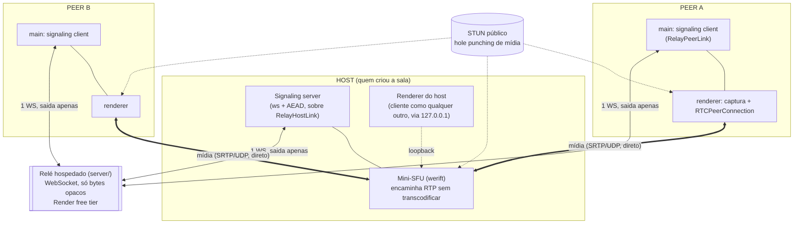
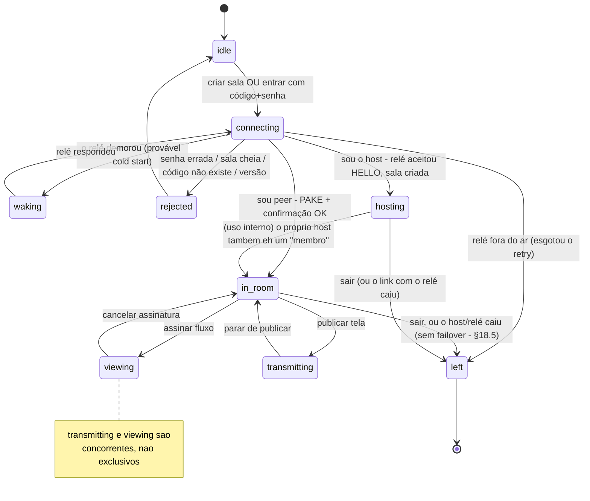
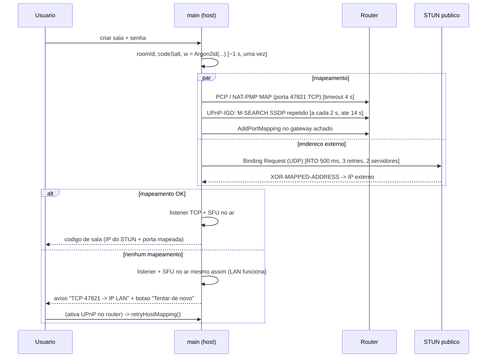
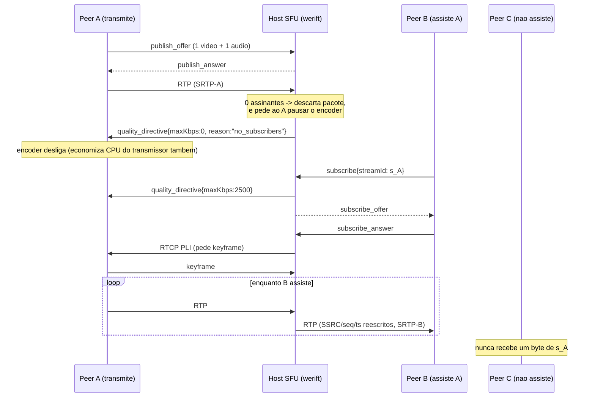
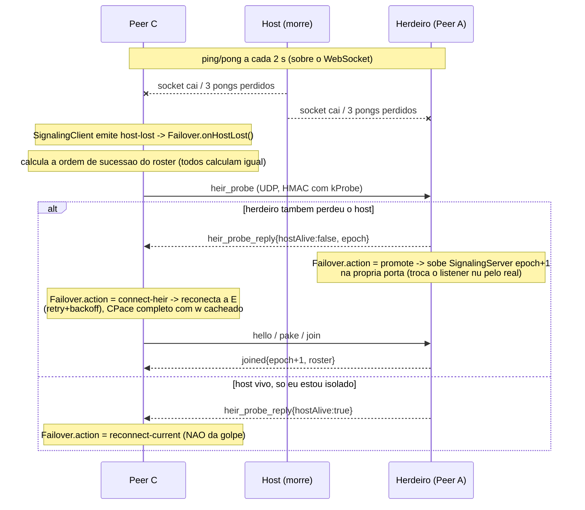

# Design Doc — `erros-share`
### Compartilhamento de tela P2P multi-transmissor

| | |
|---|---|
| **Versão** | 0.4 — Fases 0-3 (mídia) concluídas; sinalização migrada para o relé hospedado |
| **Alvo** | Windows 11 x64 |
| **Stack** | Electron + WebRTC (Chromium) + WebRTC nativo em Node (werift) + relé Node hospedado (`server/`) |
| **Escala** | até 12 participantes por sala |
| **Status** | plano de controle sobre o relé + mídia P2P funcionando e testados; failover automático **parcado** (ver §18) |

> Documentação e UI em pt-BR. Código, identificadores, campos de protocolo e comentários em inglês.
>
> **v0.4 é um desvio da restrição fundadora original ("nenhuma infraestrutura
> mantida pelo usuário").** Por decisão explícita do usuário (não é mais o
> plano "totalmente serverless" das versões 0.1-0.3): a **sinalização** agora
> passa por um relé hospedado gratuito (Render), porque exigir que o host abra
> uma porta no roteador era o maior ponto de atrito do produto. A **mídia**
> continua P2P via ICE/STUN, sem relé. Ver §18 para a arquitetura completa e o
> porquê.

---

## 0. Estado da implementação (leia primeiro numa nova sessão)

**Fases 0-3 concluídas na arquitetura original (serverless); depois disso, a
sinalização foi migrada para um relé hospedado (v0.4, §18) por pedido
explícito do usuário — o atrito de "abrir porta no roteador" era grande demais.
Consequência: o failover automático de host (Fase 2) foi PARCADO (código
mantido em `parked/`, fora do build) porque o modelo de relé v1 não tem
reconexão do host; ver §18.5.**

**O que já existe e passa nos testes** (`npm test` → 167 testes, 21 arquivos;
`npm run typecheck` limpo — Node + web + `server/`; `npm audit` → 0
vulnerabilidades em ambos os `package.json`):

| Área | Módulos | Status |
|---|---|---|
| Cripto | `src/main/crypto/{lv,kdf,cpace,aead}.ts` | CPace ristretto255/SHA-512 **verificado contra o vetor de teste do CFRG**; Argon2id 64 MiB; AES-256-GCM. Roda ponta a ponta através do relé sem mudança nenhuma. |
| Frames | `src/main/net/{connection,frame-codec}.ts` | enquadramento autenticado, contador anti-replay, fila para corrida texto→binário |
| Transporte | `src/main/net/{transport,ws-source,relay-link,relay-wire}.ts` | `Connection` roda sobre um `Transport` abstrato (§18.2): `WsTransport`+`WsConnectionSource` (WS local, só testes) ou `RelayHostLink`/`RelayPeerLink` (produção, via `server/`) |
| Código de sala | `src/main/room/{base32,ip,room-code}.ts` | Base32 Crockford + CRC-16; **v2** carrega só `roomId`+`codeSalt` (§5, §18.4) — nenhum IP/porta |
| Relé (hospedado) | `server/src/{index,relay,wire}.ts` | multiplexador WS que só encaminha bytes opacos; deploy Render (`server/render.yaml`); ver §18 |
| Sinalização | `src/main/signaling/{server,client,handshake,roster,rate-limit,heartbeat}.ts` | `SignalingServer` (host) + `SignalingClient` (peer), agora sobre um `Transport`/`ConnectionSource` injetado em vez de abrir o próprio socket; admissão por senha; rate limit por IP; heartbeat ping/pong |
| Protocolo | `src/shared/protocol.ts` | todas as mensagens em `zod`; `epoch` no envelope e no `joined` |
| **App shell** | `src/main/index.ts`, `src/main/app/{room-session,ipc}.ts`, `src/preload/index.ts`, `src/renderer/` | Electron + React (pt-BR); `RoomSession` (host abre `RelayHostLink`+`SignalingServer`, peer abre `RelayPeerLink`+`SignalingClient` direto, sem `PeerNode`); IPC tipado por `window.erros`; lobby + tela de sala com roster ao vivo e código. `npm run dev` sobe tudo |
| **Captura local** | `src/main/app/capture.ts`, `src/renderer/src/{capture.ts,CapturePanel.tsx}` | listar telas/janelas com thumbnail, `setDisplayMediaRequestHandler` com áudio de sistema (`audio: 'loopback'`), prévia local em `<video>` |
| **SFU + mídia** | `src/main/sfu/{router,codecs,media-plane,governor}.ts`, `src/renderer/src/{rtc.ts,StreamsPanel.tsx}` | mini-SFU werift no `main`: 1 PC por publisher, 1 por (assinante×stream); encaminha RTP sem transcodificar; PLI ao primeiro pacote. Negociação **non-trickle**. Encaminhamento seletivo (`demand-changed` → pausa/retoma o encoder do dono). **Governor**: escada de 4 níveis, `stats_report` (perda/CPU) a cada 4 s, `quality_directive` com `scaleDownBy`. **werift↔werift testado** (`test/sfu/{router,media-plane,governor}.test.ts`); **werift↔Chromium só valida com o app real** (docs/TESTING-MEDIA.md) |
| Spike | `scripts/spike-sfu-throughput.mts`, `docs/SPIKE-SFU.md` | werift sustenta ~6.200 pkt/s a ~64% de um núcleo (pior caso) |
| Ferramenta | `scripts/check-network.mts` (`npm run check:network`) | roda STUN+CGNAT na rede real (só relevante pra mídia agora — a sinalização não precisa mais disso) |
| **Parcado** (`parked/`, fora do build) | `peer-node.ts`, `failover.ts`, `heir-probe.ts`, `host-endpoint.ts`, `nat-mapping.ts` + testes | failover automático de host (Fase 2) e a descoberta STUN/UPnP do plano de controle. Ver §18.5 e `parked/README.md`. |

**O que NÃO existe ainda:** ICE trickle (hoje non-trickle); teste de campo real
werift↔Chromium entre máquinas; failover de host sobre o relé (§18.5, ideia
registrada, não implementada); `src/main/config/` (settings.json) ainda não
existe — `ERROS_RELAY_URL` hoje só vem de env var ou do valor padrão embutido
(§18.4).

**Toolchain:** `electron@44` + `electron-vite@5` (com `vite@7` — fixado porque
`electron-vite` ainda não aceita vite 8) + `@vitejs/plugin-react@5` +
`react@19`. `werift` está em `dependencies`. Dois tsconfig na raiz:
`tsconfig.json` (Node: main/preload/shared/test) e `tsconfig.web.json`
(renderer: DOM + jsx) — **`parked/` fica fora de ambos** (não compila, não
roda). `server/` é um pacote **separado**, com seu próprio
`package.json`/`tsconfig.json`/`node_modules` (deploy independente; ver seu
README). O preload é forçado a `.cjs` (`electron.vite.config.ts`) porque
preload em sandbox precisa ser CommonJS. `src/renderer/vite.config.ts` existe
só para rodar o renderer sozinho no browser (`vite src/renderer`, com `?mock` →
`src/renderer/src/mock.ts` stub-a o `window.erros`).

**Desvios do design já decididos e implementados** (todos com o OK do usuário):
1. **Sinalização hospedada num relé** (v0.4, §18) em vez de o host abrir uma
   porta — desvio da restrição fundadora original. A mídia continua P2P.
2. **Failover automático de host — parcado** (§18.5, `parked/`) até o relé v2
   suportar reconexão do host. Ver decisão 6 abaixo, que ainda vale para
   quando isso voltar.
3. **Plano de controle sobre WebSocket**, não sobre data channel SCTP (§2.3). O heartbeat roda sobre o WebSocket com o host (hoje: através do relé).
4. **STUN hand-rolled** (`src/main/net/stun.ts`) em vez de um pacote npm (árvore de dependências podre). Usado só pela mídia agora.
5. **`inboundVerified` é só um TCP connect de volta**, e hoje é **inerte com o relé** (o host só vê `ip:'relay'` de cada peer — não há mais um IP real para provar). Ver §14, limitação, e §18.5.
6. *(histórica, parcada junto com o failover)* **`heir_probe` era UDP autenticado por `w`**, não um WebSocket ocioso permanente com o herdeiro (§9.1). **`@achingbrain/nat-port-mapper`** em vez de `nat-api`. Na promoção, o novo host não rodava um cliente próprio.
7. **O peer deriva `w` de forma lazy** (correção da v0.3): `RoomSession.join` passa `{password, codeSalt}` para o `SignalingClient`, que deriva `w` só depois do `hello_ack` do host, com o `argonParams` real do host — não mais um `argonParams` default assumido de antemão.
8. **`server/`: `typescript`/`@types/*` em `dependencies`, não `devDependencies`.** Descoberto no primeiro deploy real: Render (e qualquer PaaS com `buildCommand`+`startCommand` no mesmo container, sem estágio de build separado) roda `npm ci` com `NODE_ENV=production` já no ambiente — a partir do npm 9 isso faz `devDependencies` serem puladas silenciosamente, e o `tsc` do `buildCommand` quebra com `TS2688` por faltar `@types/node`. `server/README.md` documenta o porquê pra ninguém "corrigir" isso de volta.

**Decisões pendentes de confirmação:** ver §16 (perguntas em aberto) — codec (VP9 vs H.264), E2EE de mídia (confirmado: **fora da v1**), e a interop werift↔Chromium (só validável com renderer real). Além disso, ver §18.6: a URL real do relé de produção (hoje um placeholder em `relay-config.ts`) precisa ser preenchida quando o usuário fizer o deploy no Render.

### Como retomar

Se o pivô do relé (§18) já está OK e funcionando: o próximo trabalho é
**mídia** — SFU-peer conectando outbound-only + `iceServers` STUN por padrão
(§18 menciona isso como pendente), e o teste de campo real (§17.3 item 7). Se
em vez disso você está estendendo o relé (failover v2, TURN, etc.), comece por
§18.5 e `parked/README.md`. O ponto de entrada histórico da Fase 3 (mídia,
antes do pivô do relé) é o **§17** no fim deste documento — ainda válido para
tudo que não é sinalização.

---

## 1. Objetivo e escopo

Aplicação desktop onde várias pessoas em **casas e redes diferentes, pela internet, sem VPN** entram numa mesma sala, transmitem a tela simultaneamente e escolhem individualmente quais transmissões assistir.

**Restrição fundadora original:** nenhuma infraestrutura mantida pelo usuário. O
executável é idêntico em todos os PCs; quem cria a sala vira o coordenador
(`host`) daquela sessão para a **mídia**. STUN público é permitido (um pacote
UDP, sem mídia). TURN é apenas ponto de extensão opcional.

> **Desvio explícito (v0.4, §18):** a restrição acima foi relaxada para a
> **sinalização apenas**. Um relé hospedado (mantido pelo autor do app, não
> pelo usuário que cria a sala) multiplexa o plano de controle, porque exigir
> que cada host abra uma porta no roteador era o maior ponto de atrito do
> produto. O relé só vê bytes opacos (CPace + AEAD continuam ponta a ponta) e
> a mídia continua 100% P2P. `server/` documenta como rodar seu próprio relé
> se preferir não depender do público.

**No escopo:** captura de tela inteira ou janela + áudio do sistema; múltiplos transmissores; assinatura seletiva de fluxos; autenticação por código + senha. **Failover automático de host** estava no escopo original (Fase 2, implementado) mas está **parcado** desde o pivô do relé — §18.5.

**Fora do escopo nesta rodada:** microfone, webcam, gravação, chat com UI, auto-update, macOS/Linux.

---

## 2. Visão geral da arquitetura

Dois planos separados, com requisitos de rede diferentes. Essa separação é a decisão central do design — e é exatamente o que tornou o pivô do §18 possível sem tocar na mídia.

| | **Plano de controle** | **Plano de mídia** |
|---|---|---|
| Transporte | WebSocket sobre TCP, com AEAD próprio, multiplexado através do relé | WebRTC (ICE/DTLS-SRTP sobre UDP) |
| Topologia | estrela pelo **relé hospedado** (host e peers só fazem conexões de saída) | estrela pelo host-SFU |
| Onde roda | processo `main` (Node) fala com `server/` (Node, hospedado) | `renderer` (Chromium) nos clientes, `main` (werift) no host |
| Precisa de porta de entrada | **não, em ninguém** (§18) | não (hole punching por ICE) |
| Volume | ~centenas de bytes/s | Mbps |



### 2.1 Por que o SFU é nativo no `main`, e não no renderer

O caminho "óbvio" seria o renderer do host pegar o `MediaStreamTrack` recebido do peer A e fazer `addTrack` na `RTCPeerConnection` do peer B. **Isso força decodificação + recodificação** por destino: o Chromium não repassa RTP entre `PeerConnection`s. Com 2 transmissores e 11 espectadores, o host precisaria de ~22 encoders 1080p30 simultâneos — inviável em qualquer PC doméstico.

Um SFU de verdade só reescreve cabeçalhos RTP (SSRC, sequência, timestamp) e re-encripta SRTP para cada destino. Custo por pacote, não por frame; **zero encoders**. Para isso precisamos de uma pilha WebRTC que nos dê acesso a RTP, o que o Chromium não expõe. Daí `werift` (WebRTC puro em TypeScript, roda em Node) no processo `main`.

Efeito colateral bem-vindo: o SFU é um módulo Node que qualquer instância pode ligar; o renderer do host conecta ao seu próprio SFU por `127.0.0.1`. O código do cliente é idêntico em host e peer — o que teria tornado o failover uma troca de configuração em vez de arquitetura, se ele não estivesse parcado (§18.5).

### 2.2 A sinalização é hospedada: por que um relé (v0.4)

Resumo executivo; a arquitetura completa, o protocolo do relé, o modelo de ameaça e o deploy estão no **§18**.

O plano de controle (§2.2 tabela) é um WebSocket cliente-servidor: **alguém** precisa aceitar a conexão. Nas versões 0.1-0.3 esse alguém era o host, o que exigia abrir uma porta TCP no roteador (PCP/NAT-PMP/UPnP, com fallback manual) — de longe o maior ponto de atrito relatado ao usar o app. A mídia nunca teve esse problema: WebRTC/ICE faz hole punching UDP, então **só a sinalização** precisava de uma porta de entrada.

A correção óbvia — meter um servidor no meio só para o WebSocket de controle — não precisa saber nada sobre a sala: ele só *encaminha* bytes entre o host e cada peer. CPace e os frames AES-256-GCM continuam ponta a ponta, então esse servidor **nunca vê a senha, o SDP, os candidatos ICE, a mídia, ou os nicknames em claro**; ele só vê `roomId`, contagem de conexões, e o IP de quem conecta (para rate limiting). Isso é o que permite hospedá-lo de graça (Render free tier) sem alargar o modelo de confiança: ele é tratado como uma rede hostil, exatamente como o ISP já era no modelo de ameaça original (§10).

Com isso, host e peers passam a ter **conexões de saída apenas** — o problema de NAT/porta para a sinalização desaparece por completo. A troca é: o app agora depende de um serviço hospedado estar no ar (mitigado documentando como rodar o seu próprio, `server/README.md`) e o relé free-tier dorme após inatividade (mitigado com retry + keep-alive, §18.4).

### 2.3 Por que WebSocket + AEAD próprio, e não TLS, e não data channel

**Contra TLS:** o host (hoje, o relé) não tem um nome DNS com CA válida por padrão, então só sobra certificado autoassinado ou confiar na TLS terminada pelo provedor do relé — e nesse segundo caso o relé passaria a poder ler o tráfego. O handshake por senha (§6) já produz um segredo compartilhado **mutuamente autenticado entre host e peer**; derivar as chaves de transporte dele dá confidencialidade, integridade e autenticação *ponta a ponta*, que nenhuma TLS terminada num meio de caminho consegue — o relé roteia bytes cifrados que ele não consegue abrir de qualquer forma. Usamos `ws://`/`wss://` como enquadramento (`wss://` na perna cliente↔relé, para o relé; a cifra que importa é a AEAD por cima) e cifra própria por cima (AES-256-GCM), com o handshake sendo a primeira coisa que acontece no socket.

**Contra data channel SCTP para o controle** (desvio proposto à decisão 4 — ver §16, pergunta 1): o WebSocket com o host (via relé) tem que existir de qualquer forma para trocar SDP/ICE. Um data channel exigiria, *depois disso*, ICE + DTLS + SCTP para carregar as mesmas mensagens de controle — mais código, mais latência de estabelecimento. O heartbeat sobre o WebSocket detecta precisamente o evento que importa (processo do host, ou seu link com o relé, desaparecer). Continuamos com data channels reservados para o ponto de extensão de chat (decisão 8), aí sim sobre a mídia.

---

## 3. Processos, módulos e IPC

Estado real da árvore (tudo `✅` existe e é testado, salvo indicação contrária):

```
src/
  shared/
    protocol.ts            esquemas zod de TODAS as mensagens (+ epoch)
    ipc.ts, ipc-schema.ts   contrato main <-> renderer + validação de entrada
  main/                      # Node — nada de UI
    crypto/
      lv.ts                 leb128 / lv_cat do CPace
      kdf.ts                Argon2id + HKDF + derivação de chaves
      cpace.ts              PAKE ristretto255 (vetor do CFRG)
      aead.ts               AES-256-GCM
    net/
      connection.ts         Connection: texto→binário, fila anti-corrida
      frame-codec.ts        enquadramento + contador anti-replay
      transport.ts          abstração Transport/ConnectionSource (§18.2); WsTransport
      ws-source.ts          ConnectionSource local (WS direto) - só skipNat/testes
      relay-link.ts         RelayHostLink / RelayPeerLink - clientes do relé (§18.2)
      relay-wire.ts         formato de frame do relé, lado cliente (§18.3)
      relay-config.ts       resolve ERROS_RELAY_URL (§18.4)
      stun.ts               cliente STUN hand-rolled - só mídia agora
      local-ip.ts           IP LAN primário - só mídia agora
    room/
      base32.ts ip.ts       Base32 Crockford, IPv4/IPv6
      room-code.ts          encode/decode do código v2: roomId+codeSalt (§5, §18.4)
    signaling/
      handshake.ts          conduz o CPace nos dois papéis
      server.ts             SignalingServer (host) - roda sobre um ConnectionSource
      client.ts             SignalingClient (peer) - roda sobre um Transport
      roster.ts             estado autoritativo do host
      rate-limit.ts         RateLimiter por IP
      heartbeat.ts          ping/pong, timer-agnóstico
    election/
      succession.ts         ordem determinística (puro) - usada só por transferHost, dormente
    sfu/
      router.ts             werift: 1 PC por publisher, 1 por (assinante×stream)
      codecs.ts              VP8/VP9/H264 + Opus
      media-plane.ts         traduz Body <-> chamadas do router
      governor.ts             escada de qualidade (§8.5)
    app/
      room-session.ts        une host (server+relé) ou peer (client+relé) numa sessão
      ipc.ts                  handlers de ipcMain
      capture.ts              desktopCapturer + setDisplayMediaRequestHandler
    index.ts                  entry do processo main do Electron
  preload/
    index.ts                  contextBridge -> window.erros
  renderer/                   React pt-BR
    src/App.tsx                lobby + tela de sala
    src/rtc.ts                  useMedia(): publish/subscribe, stats, directives
    src/{capture,CapturePanel,StreamsPanel}.tsx
server/                       # pacote SEPARADO - o relé hospedado (§18)
  src/index.ts                 HTTP+WS server; createRelayHttpServer() exportado p/ testes
  src/relay.ts                  Relay: registro de salas, roteamento, rate limit
  src/wire.ts                    formato de frame do relé, lado servidor (§18.3)
  render.yaml                   Render Blueprint (deploy)
parked/                       # FORA do build (nem tsc nem vitest) - §18.5
  peer-node.ts failover.ts heir-probe.ts host-endpoint.ts nat-mapping.ts + testes
scripts/
  spike-sfu-throughput.mts    spike werift (docs/SPIKE-SFU.md)
  check-network.mts           npm run check:network (STUN/CGNAT p/ mídia)
```

Segurança do Electron: `contextIsolation: true`, `nodeIntegration: false`, `sandbox: true` no renderer, CSP restritiva, `preload` expondo só um canal tipado. A rede nunca toca no renderer — tudo entra pelo `main`, é validado com `zod`, e só então vira IPC.

---

## 4. Máquina de estados do participante



`transmitting` e `viewing` são flags sobre `in_room`, não estados exclusivos: dá para transmitir e assistir ao mesmo tempo. `waking` existe só para dar feedback visual durante um cold start do relé free-tier (§18.4) — não é um estado de erro.

> **Mapeamento para o código:** `connecting`/`waking` = `RoomSession.host()`/`.join()` chamando `openWithRetry(RelayHostLink.open | RelayPeerLink.open)`, então `SignalingClient.connect()` + `runPeerHandshake` do lado peer; `in_room` = pós-`joined`; `hosting` = `RoomSession` com um `SignalingServer` ativo. `transmitting`/`viewing` vêm de `useMedia()` no renderer. **Não existe mais** `reconnecting`/`host_promotion`: eram do failover automático, parcado em §18.5 — hoje qualquer queda do host ou do relé leva direto a `left`, com uma `notice` explicando por quê.

---

## 5. Formato do código de sala

**v2 (desde o pivô do relé, §18.4).** Antes da v0.4 o código carregava onde
estava o host (`address`+`port`) porque quem entrava discava direto nele. Com
a sinalização hospedada, todo cliente disca o mesmo `relayUrl` (§18.4) — o
código só precisa dizer **qual** sala, ao relé. Segue sem carregar segredo
nenhum.

```
byte 0       version                 (u8 = 2)
bytes 1-4    roomId                  (4 bytes aleatorios - chave de sala no rele)
bytes 5-10   codeSalt                (6 bytes aleatorios)
ultimos 2    crc16                   (CCITT, sobre tudo acima)
```

Corpo de 11 bytes + 2 de CRC = **13 bytes → 21 caracteres** em Base32 Crockford
(maiúsculas, sem `I/L/O/U`), exibidos em 3 grupos de 7:

```
K7QM4X2-A9BTR0F-DW6HJE3
```

Entrada tolerante: normaliza minúsculas, aceita/ignora hífens e espaços, mapeia `I→1 L→1 O→0`, valida CRC-16 antes de qualquer tentativa de rede (erro de digitação é detectado localmente). Um código v1 (20 ou 32 bytes) é rejeitado pelo tamanho antes mesmo de checar a versão — mensagem clara de "versão não suportada" em vez de um erro de rede confuso.

**Propriedade importante, inalterada:** o código pode ser compartilhado por qualquer canal inseguro. Ele não é secreto e sua integridade não é crítica — quem interceptar ou alterar o código não consegue nada, porque o PAKE (§6) impede que um host falso se autentique, e o relé (§18) não autentica ninguém, só limita taxa por IP. A senha é o único segredo, e ela nunca trafega. Isso é o que permite mandar o código no WhatsApp sem cerimônia.

`codeSalt` existe para que a mesma senha em salas diferentes produza chaves diferentes. Como o Argon2id quer salt de 16 bytes e não vamos inflar o código, o salt real é `HKDF-Expand(roomId ‖ codeSalt, "erros-share/argon-salt/v1", 16)` — 80 bits de unicidade, suficiente porque o salt não é secreto e o ataque de dicionário aqui é *online-only* (§6).

`roomId` (4 bytes = 32 bits) também é a chave que o relé usa para rotear (`server/src/relay.ts`, um `Map<roomId, Room>`); com o limite de `maxRooms` do relé (§18) na casa das centenas, a chance de colisão é desprezível, e uma colisão só produz um erro `room_exists` ao criar (o usuário tenta de novo, gera outro `roomId`) — não é uma falha de segurança.

Como não há mais failover automático (§18.5), o código de uma sala em andamento não muda mais sozinho; ele só para de funcionar quando a sala termina (o host saiu, ou o link dele com o relé caiu).

---

## 6. Autenticação e criptografia do plano de controle

### 6.1 O que queremos

Só quem sabe a senha entra; quem tem só o código não consegue nem entrar nem espiar; a senha não trafega nem em hash; e um atacante que capture o handshake completo **não deve conseguir atacar a senha offline**. Esse último requisito é o que exige um PAKE de verdade — um desafio-resposta com Argon2id vaza um MAC sobre transcript conhecido, o que dá ao atacante ativo um oráculo offline para testar bilhões de senhas.

### 6.2 CPace sobre ristretto255

Escolha: **CPace** (`draft-irtf-cfrg-cpace`, o PAKE balanceado selecionado pelo CFRG), implementado sobre `@noble/curves` (ristretto255) e `@noble/hashes`.

Por que CPace e não SPAKE2/SRP: CPace é balanceado (os dois lados sabem a mesma senha — exatamente o nosso caso, ao contrário de SRP/OPAQUE que assumem um servidor com verificador), não precisa de pontos-geradores fixos com proveniência duvidosa como o SPAKE2, e a construção inteira cabe em ~80 linhas auditáveis sobre primitivas já auditadas. Alternativa considerada: SRP-6a via `tssrp6a` (biblioteca pronta, design antigo, grupo de 2048 bits) — ver §16, pergunta 2.

```
# uma vez por sala, cacheado no processo (depende so de senha + salt)
w    = Argon2id(password, salt, m=64MiB, t=3, p=1, 32 bytes)

# por conexao
sid  = 16 bytes aleatorios do host
G    = RistrettoPoint.hashToCurve( SHA-512("CPace-ristretto255/v1" ‖ w ‖ sid ‖ ad) )
      onde ad = roomId ‖ protocolVersion

peer:  ya aleatorio, Ya = ya·G  ->  host
host:  yb aleatorio, Yb = yb·G  ->  peer
K    = ya·Yb = yb·Ya
ISK  = HKDF-SHA512( K ‖ Ya ‖ Yb, salt=sid, info="CPace-ISK/v1" )

# confirmacao obrigatoria nas duas direcoes antes de qualquer outra mensagem
MAC_host = HMAC(ISK, "confirm-host" ‖ transcript)
MAC_peer = HMAC(ISK, "confirm-peer" ‖ transcript)

# derivacoes
k_c2s        = HKDF(ISK, "frame-c2s/v1", 32)
k_s2c        = HKDF(ISK, "frame-s2c/v1", 32)
roomMediaKey = HKDF(w,   "media-key/v1", 32)     # igual para todos, sobrevive ao failover
```

`w` depende apenas de (senha, salt), então é calculado **uma vez por processo** e reutilizado em todo handshake — inclusive nos reconnects e no failover. Isso nos deixa usar parâmetros caros (64 MiB) sem penalizar o uso normal, enquanto o atacante que tenta adivinhar paga 64 MiB **por tentativa e obrigatoriamente online**, contra um host que também aplica rate limit.

`roomMediaKey` vem de `w`, não de `ISK`, justamente para ser igual em todos os participantes e sobreviver a troca de host — é o que habilita o E2EE opcional de mídia (§8.4).

### 6.3 Enquadramento

Depois da confirmação, cada frame é `AES-256-GCM`, nonce = `4 bytes fixos ‖ contador u64 por direção` (estritamente crescente; repetição = derrubar a conexão), AAD = `versão ‖ direção ‖ tamanho`. Payload = JSON UTF-8 validado por `zod`. Limite de 256 KiB por frame.

### 6.4 Defesas do host contra quem só tem o código

Máximo de 3 handshakes concorrentes; 5 tentativas por IP em 60 s, depois backoff exponencial até 15 min; toda falha de senha responde no mesmo tempo (sem oráculo de timing); um `w` errado simplesmente não fecha a confirmação; nenhuma informação da sala (roster, nicknames, quem transmite) é revelada antes da confirmação. A senha só existe em memória — **nunca em disco**, nem em log, nem em crash dump (o buffer é zerado ao sair da sala; `w` também).

---

## 7. Protocolo de sinalização

Envelope comum, dentro do frame cifrado:

```jsonc
{ "v": 1, "epoch": 3, "seq": 42, "from": "p_7a1c...", "type": "...", /* campos do tipo */ }
```

`epoch` é o contador monotônico de gerações de host (§9). Toda mensagem que carregue autoridade de host é rejeitada se `epoch` for menor que o conhecido.

### 7.1 Handshake e admissão

> **Implementado** em `src/shared/protocol.ts` (schemas `zod`) + `src/main/signaling/handshake.ts`. Nomes reais entre parênteses.

| # | Direção | `type` | Conteúdo |
|---|---|---|---|
| 1 | peer → host | `hello` | `appVersion`, `protoVersion`, `roomId` (hex) |
| 2 | host → peer | `hello_ack` | `sid` (hex), `protoVersion`, `argonParams{m,t,p}` |
| 3 | peer → host | `pake_peer` | `ya` (hex) |
| 4 | host → peer | `pake_host` | `yb` (hex), `macHost` (hex) |
| 5 | peer → host | `pake_confirm` | `macPeer` (hex) |
| — | | | *daqui em diante tudo é cifrado com `k_c2s`/`k_s2c`, ws binary frames* |
| 6 | peer → host | `join` | `nickname`, `clientCaps{canHost, inboundPort}` |
| 7 | host → peer | `joined` | `peerId`, `joinSeq`, `epoch`, `roomParams`, `roster[]` |
| 8 | host → todos | `roster_update` | delta: `{added[], removed[], changed[]}` |

- **Antes da criptografia**, o host pode responder `handshake_reject{reason}` com `reason ∈ {room_id_mismatch, version_mismatch, rate_limited, too_many_handshakes, room_closing, bad_message}`. Senha errada: o peer envia `pake_confirm` mesmo assim (com MAC inválido) para o host não ficar esperando; os dois lados detectam e derrubam.
- **Depois da criptografia**, o host pode responder `rejected{reason}` com `reason ∈ {room_full, duplicate_nickname, room_closing, bad_message}`.
- Ainda **não implementado:** `streams[]` no `joined` (entra na Fase 3).

### 7.2 Roster

> **Implementado** em `src/main/signaling/roster.ts`; schema `rosterEntrySchema` em `protocol.ts`. Forma atual:

```jsonc
{
  "peerId": "p_7a1c9e",
  "nickname": "pedro",
  "joinSeq": 4,
  "isHost": false,
  "inboundVerified": true,       // host provou que consegue conectar de volta (§8.2)
  "inboundEndpoint": { "address": "203.0.113.9", "port": 47821 } | null,
  "publishing": null             // { video, audio, streamId } — preenchido na Fase 3
}
```

Snapshot completo no `joined` + deltas (`roster_update`) no evento. Toda mudança passa pelo host, que serializa com `seq` — não há resolução de conflito porque não há escrita concorrente. **Ainda não há** o campo `quality` nem o snapshot periódico de 15 s (não fez falta até agora).

### 7.3 Mídia — **NÃO IMPLEMENTADO (Fase 3)**

Estas mensagens estão só esboçadas; nenhuma está nos schemas `zod` nem no servidor ainda.

| `type` | Direção | Papel |
|---|---|---|
| `publish_request` | peer → host | anuncia intenção de transmitir, pede `streamId` |
| `publish_offer` / `publish_answer` | peer ↔ host | SDP do upstream peer → SFU |
| `subscribe` / `unsubscribe` | peer → host | `{streamId, kinds:["video","audio"]}` |
| `subscribe_offer` / `subscribe_answer` | host ↔ peer | SDP do downstream SFU → peer |
| `ice_candidate` | ambos | trickle ICE, `{mid, candidate}` |
| `stream_state` | host → todos | `{streamId, state: "live"\|"paused"\|"ended"}` |
| `quality_directive` | host → peer | `{streamId, maxKbps, maxFps, scaleDownBy, reason}` |
| `stats_report` | peer → host | RTT, perda, jitter, CPU, resolução recebida |

### 7.4 Liveness e failover

> `ping`/`pong` estão **ativos**. `host_transfer` está implementado em `SignalingServer.transferHost()` mas **nada o chama** hoje (era acionado pelo desligamento gracioso do `PeerNode`, parcado - §18.5); ele continua no schema porque o mecanismo é barato de manter e volta a fazer sentido se o failover for revivido. `heir_probe`/`heir_probe_reply` — protocolo UDP separado, `parked/heir-probe.ts` — está **parcado** junto com o resto do failover.

| mecanismo | onde | Papel |
|---|---|---|
| `ping` / `pong` | envelope; `heartbeat.ts` | a cada 2 s; 3 perdidos ⇒ "host-lost" (peer) / a sala termina (host via `RoomSession`, sem promoção) |
| `host_transfer` | envelope | **dormente** - saída graciosa: `{successorPeerId, epoch}`; nada chama `transferHost()` hoje |
| `heir_probe` / `heir_probe_reply` | **UDP**, `parked/heir-probe.ts` | **parcado** - peer → herdeiro: "seu link com o host está vivo?" |
| `bye` | envelope | saída limpa, com motivo |

**Não implementados** e por quê (registro histórico, da época em que o failover era o plano):
- `heir_designation` — desnecessário: o herdeiro seria calculado de forma determinística do roster por todos (`src/main/election/succession.ts`, ainda no tree, dormente).
- `host_announce` — o modelo adotado era *reconnect-from-scratch*. Ver §18.5 para o que seria necessário para reviver isso sobre o relé.

---

## 8. Estabelecimento de sessão e estratégia de NAT

### 8.1 Criar sala (host) — ver §18 para o fluxo atual

> **Superado pelo pivô do relé (v0.4).** Esta subseção descreve como a Fase 1-2
> criava uma sala (STUN + PCP/NAT-PMP/UPnP no roteador do host). Está mantida
> como registro histórico e porque `parked/host-endpoint.ts` +
> `parked/nat-mapping.ts` ainda implementam exatamente isto, caso um modo
> "sem relé, LAN/IP direto" volte a fazer sentido no futuro. **O fluxo real
> hoje é `RoomSession.host()` → `openWithRetry(RelayHostLink.open)` →
> `SignalingServer({source: link})`, sem tocar em STUN/UPnP** — ver §18.1 e
> §18.4.



Detalhe que exigia cuidado e era fácil errar: **STUN é UDP e não descobre o mapeamento externo de uma porta TCP.** O código de sala se montava assim: **IP externo vinha do STUN**; **porta vinha do mapeamento** (pedíamos explicitamente `externalPort == internalPort`) ou do que o usuário configurou manualmente. Renovação: mapeamentos UPnP/PCP têm lease, renovados a cada `lease/2`. Carrier-grade NAT (IP do STUN em `100.64.0.0/10`) era detectado e reportado explicitamente.

### 8.2 Entrar na sala e prova de alcançabilidade — parcialmente superado

O peer decodifica o código (v2, §5) e disca o **relé** (não mais o host direto) — `RoomSession.join()` → `openWithRetry(RelayPeerLink.open)` → `SignalingClient` roda o PAKE (§6) sobre esse link, e envia `join`.

`join.clientCaps.inboundPort` e a verificação `inboundVerified`/`inboundEndpoint` do parágrafo original abaixo **ficaram dormentes**: com o relé no meio, o host só enxerga `ip: 'relay'` para todo mundo (§18.2) — não há mais um IP real do peer para provar alcançável. `SignalingServer` continua aceitando `verifyInbound: true` (é só uma probe TCP condicional), mas `RoomSession` não liga mais essa opção, e o campo `inboundVerified` no roster fica sempre `false` para peers. Como a eleição de sucessor que consumia esse fato está parcada (§9, §18.5), isso não tem efeito prático hoje.

> Texto original (Fase 1-2), preservado porque é exatamente o que `parked/` reviveria: em paralelo, cada peer tentava abrir seu próprio mapeamento na entrada, mesmo sem intenção de ser host — o peer anunciava a porta em `join.clientCaps.inboundPort` e o host tentava conectar de volta em `IP-de-origem:porta` (só um TCP connect - o "handshake curto" de prova de identidade era um TODO). Se conectasse, o roster ganhava `inboundVerified: true` e `inboundEndpoint: {address, port}`, e a eleição de sucessor (§9) trabalhava com fato verificado. Implementado em `src/main/net/reachability.ts` (`tcpReachable`); o `parked/peer-node.ts` rodava um listener TCP nu na porta de entrada só para o probe passar.

### 8.3 Mídia: ordem de tentativas ICE

Para cada par (peer, SFU), a `RTCPeerConnection` do peer e o transporte werift do host coletam, na ordem:

1. **`host` candidates** — IPs locais. Cobre o host assistindo a si mesmo (`127.0.0.1`) e, se por acaso duas pessoas estiverem na mesma LAN, o caminho direto.
2. **`srflx` via STUN** — o caminho normal na internet. Como a sinalização já existe, os dois lados trocam candidatos e fazem hole punching **simultâneo**, o que funciona na grande maioria dos NATs domésticos. É por isso que **só o host precisa de porta de entrada: a mídia se resolve por hole punching.**
3. **`relay` via TURN** — só se o usuário configurou. Última opção, com `iceTransportPolicy: 'all'` (nunca forçamos relay).

Timeouts: 20 s para `connected`; em `disconnected`, 5 s de espera (é frequentemente transitório) e depois um `restartIce()`; em `failed`, uma renegociação completa; duas falhas seguidas e a UI diz o que aconteceu, nomeando NAT simétrico e sugerindo TURN. `iceCandidatePoolSize: 2` para acelerar.

**Quando falha de verdade:** os dois lados com NAT simétrico (mapeamento dependente do destino) e sem TURN. Não há truque. A UI mostra isso com nome e o README explica como subir um `coturn` ou usar um TURN de terceiros. Nós não vamos inventar que "funciona em qualquer rede".

### 8.4 Fluxo de mídia no host-SFU e encaminhamento seletivo



Mecânica do forwarder, por assinatura: SSRC próprio, offset de número de sequência (para que uma pausa não abra buraco na sequência do destino), offset de timestamp, tradução de `payloadType` se a negociação diferir, `abs-send-time`/TWCC repassados, e **gating por keyframe** — um novo assinante só começa a receber a partir do próximo keyframe, e pedimos PLI imediatamente para que ele não espere o intervalo natural. RTCP: `PLI`/`FIR` de qualquer assinante são agregados (no máximo 1 por segundo por fluxo) e repassados ao publicador; `REMB`/`TWCC` de cada assinante alimentam o governor (§8.5) em vez de irem direto ao publicador — o publicador não deve reagir ao pior espectador sem que a política decida.

Codec: negociamos com preferência configurável, default **VP9 → H.264 → VP8** para vídeo (VP9 tem modo de conteúdo de tela decente; H.264 ganha quando há encoder de hardware disponível e o custo de CPU do transmissor for o gargalo) e **Opus estéreo 96 kbps, DTX desligado** para o áudio do sistema, porque é música/jogo e não voz. `track.contentHint = 'detail'` na captura de tela. A escolha final de codec é uma **medição da Fase 3**, não uma convicção.

**Sem simulcast na v1.** Consequência honesta e documentada: a qualidade de um fluxo é a mesma para todos os seus espectadores, então um espectador com internet ruim degrada a experiência dos outros ("destino compartilhado"). Simulcast de 2 camadas é o caminho natural da v2, e o forwarder já é escrito com seleção de camada em mente.

**E2EE de mídia (opcional, Fase 3b, default desligado na v1).** É viável: `roomMediaKey` já existe e é igual para todos; o renderer cifra o payload já codificado via Insertable Streams antes de sair, e o SFU — que só mexe em cabeçalho — encaminha às cegas. As complicações reais: o descritor de codec tem que ficar em claro para o gating por keyframe funcionar, e implementar SFrame (RFC 9605) direito custa tempo. Decisão: **v1 sai com DTLS-SRTP puro, e o host vê a mídia em claro.** Justificativa no modelo de ameaça (§10): o host é um participante já confiável da sala, e o fluxo que ele "vê" é o mesmo que ele está assistindo. O ponto de extensão fica pronto e a limitação vai para o README.

### 8.5 Governor: orçamento, adaptação e o limite de 2 fluxos

Duas malhas de controle, ambas no host:

**Egresso do host (proteção da sala).** Orçamento configurável, default **20 Mbps** (§11). O host soma o custo de todas as assinaturas ativas. Ao estourar, desce a escada de qualidade para os fluxos mais caros, na ordem:

| passo | resolução | fps | kbps |
|---|---|---|---|
| 0 | 1920×1080 | 30 | 2500 |
| 1 | 1920×1080 | 20 | 1800 |
| 2 | 1600×900 | 20 | 1200 |
| 3 | 1280×720 | 15 | 800 |
| 4 | 960×540 | 10 | 400 |

O host manda `quality_directive`; o transmissor aplica com `setParameters({encodings:[{maxBitrate, maxFramerate, scaleResolutionDownBy}]})`. Sinais de subida/descida: perda > 3% ou RTT crescente ou `availableOutgoingBitrate` abaixo do alvo → desce um passo (imediato); 20 s estável e folgado → sobe um passo (histerese, para não oscilar).

**Local, no cliente (proteção da máquina).** A partir de **3 assinaturas simultâneas** ou CPU sustentada acima de 80% por 10 s, a UI avisa em português e oferece: reduzir qualidade dos fluxos assistidos, ou desassinar o menos usado. Conforme a decisão 6, **é orientação, não trava** — o usuário pode ignorar, e o teto (`maxRecommendedSubscriptions`, default 2) é configurável. O que nunca acontece é baixar um fluxo que ninguém pediu.

---

## 9. Failover de host — PARCADO (§18.5)

> **Todo este §9 descreve um mecanismo parcado.** Foi implementado e testado
> na Fase 2 (`parked/{peer-node,failover,heir-probe}.ts`,
> `src/main/election/succession.ts`), e funcionava. Ficou parcado quando a
> sinalização migrou para o relé (v0.4): o relé v1 não tem conceito de
> "reconectar como o mesmo host" — se o WebSocket do host cai, o relé encerra
> a sala e avisa todo mundo (`HOST_GONE`), ponto. Reviver isto exigiria mudar
> o **relé**, não só o cliente — ver §18.5 para o que seria necessário. O
> texto abaixo é preservado porque a lógica (ordem de sucessão, `epoch`,
> `heir_probe` anti-split-brain) continua correta e reaproveitável.

### 9.1 Ordem de sucessão (determinística, calculável por todos)

Ordena o roster por:

```
1. inboundVerified desc     # quem comprovadamente aceita conexao de entrada
2. joinSeq asc              # quem entrou antes
3. peerId asc               # desempate lexicografico
```

Todos têm o mesmo roster, então todos calculam a mesma lista sem trocar mensagem. `inboundVerified` entra como chave primária porque um sucessor que não consegue abrir porta é inútil e custaria uma rodada de failover inteira — a decisão 4 já prevê "se o sucessor não conseguir abrir porta, passa para o próximo", e nós simplesmente evitamos escolhê-lo. É a mesma ordem determinística, só melhor informada.

O primeiro da lista (fora o host) é o **herdeiro**. Todo peer (não só o herdeiro) mantém seu mapeamento de porta ativo e o endereço `inboundEndpoint` que o host observou entra no roster — assim qualquer peer pode ser localizado numa promoção.

**Desvio implementado (Fase 2):** em vez de "um WebSocket autenticado ocioso de cada peer com o herdeiro", cada peer roda um **`HeirProbeResponder` UDP** na sua porta de entrada. O `heir_probe` é uma pergunta única (request/reply) sobre UDP, com HMAC nas duas direções usando `kProbe = HKDF(w, "heir-probe/v1")`. É funcionalmente equivalente para a única pergunta que importa ("o host está vivo para você?"), custa um round-trip em vez de N conexões autenticadas permanentes, e quem não tem `w` não forja resposta nem usa o responder como oráculo. O peer só abre conexão de verdade com o herdeiro quando decide re-homing.

### 9.2 Detecção, split-brain e promoção

> **Implementado.** `src/main/election/failover.ts` (coordenador), `src/main/net/heir-probe.ts` (probe UDP), `src/main/signaling/peer-node.ts` (executa as ações). Teste: `test/signaling/failover.integration.test.ts` mata o host e vê um peer promover enquanto os outros reconectam.



O `heir_probe` evita split-brain: um peer isolado pergunta ao herdeiro e, se ele responde "host vivo", o peer só reconecta — não promove ninguém. Se o herdeiro não responde (também caiu), o `Failover` desce a lista de sucessão; quando chega no próprio peer (e ele tem `inboundVerified`), promove, com atraso `staggerMs × índice` para serializar tentativas. Se a lista acaba sem ninguém elegível/alcançável → `room-dead`.

**`epoch` resolve o resto.** Contador monotônico incrementado em cada promoção, carregado no `joined`. O `SignalingClient` rejeita um `joined` com `epoch` abaixo do esperado (`minEpoch`), então um host antigo que volte do limbo não consegue readotar ninguém. Sem consenso, sem quórum — o custo é aceitar que uma partição de rede pode gerar duas salas.

**Saída graciosa** (`SignalingServer.transferHost()`): nomeia o melhor sucessor, faz broadcast de `host_transfer{successorPeerId, epoch}`, dá `graceMs` (~1,5 s) e fecha. O peer nomeado promove direto; os outros fazem `connect-heir`. Sem esperar timeout de heartbeat.

**Estado transferido:** roster, parâmetros da sala, `epoch` (no `joined`). As chaves são recalculadas de `w`. **Nenhum segredo trafega no failover.**

**Mídia após o failover (3.6):** o `PeerNode` recebe uma opção `sfu` — ao promover, ele sobe uma `SfuMediaPlane` própria e a liga ao `SignalingServer` novo. No renderer, `useMedia(streams, epoch)` observa o `epoch`: quando ele muda, todos os `RTCPeerConnection` (que apontavam para o SFU morto) são fechados; se este peer estava transmitindo, ele **re-publica** automaticamente (novo `streamId`); as assinaturas são reconciliadas por **peerId do dono** (estável no failover), então o renderer re-assina sozinho os fluxos que voltam. Interrupção de poucos segundos, sem clique do usuário. Teste: `test/signaling/failover.integration.test.ts` publica um stream sintético no herdeiro promovido e confirma o `publish_answer`.

**Se ninguém consegue ser host:** a sala encerra com mensagem explícita ("nenhum participante consegue aceitar conexões; peça a alguém para configurar port forwarding ou um TURN"). Consideramos degradar para malha pura: com 12 pessoas isso é O(N²) de encoders no transmissor (11 encodes 1080p por pessoa transmitindo), o que é pior que encerrar. **Escolha registrada: encerrar, não degradar.** Malha só faria sentido para 2–3 pessoas, e nesse caso o problema de host provavelmente também não existiria.

Meta de tempo: **< 10 s** do crash à mídia voltando (6 s de detecção + ~1 s de promoção + reconexão). A decisão 4 aceita "poucos segundos".

---

## 10. Modelo de ameaça

**Quem confia em quem.** A sala é um grupo de pessoas que já se conhecem e compartilharam uma senha por um canal externo. A confiança é *no grupo*; o host é um membro do grupo, não um terceiro; e o **relé** (novo em v0.4, §18) é tratado como rede hostil, no mesmo nível do ISP.

| Adversário | Consegue | Não consegue |
|---|---|---|
| Rede/ISP passivo | ver que há tráfego UDP/TCP entre os IPs, volume e horários | ler sinalização (AES-GCM) ou mídia (DTLS-SRTP) |
| **O relé de sinalização** (§18) | ver `roomId`, quantas conexões por sala, IPs de quem conecta (rate limit), e o volume/timing dos frames que encaminha | ler o conteúdo de qualquer frame (CPace, `w`, roster, nicknames, SDP/ICE) — tudo isso é a AEAD de dentro do WebSocket, opaca para ele; **não pode**, sozinho, entrar numa sala nem forjar uma mensagem que passe na confirmação do PAKE |
| Ativo com o código, sem a senha | tentar handshakes e ser rate-limited (pelo host E pelo relé) | entrar, ver roster, nicknames, ou qualquer mídia; **e não pode atacar a senha offline** (propriedade do PAKE) |
| Ativo tentando se passar pelo host (comprometendo o relé, ou operando o seu próprio) | fazer o peer conectar nele | passar a confirmação do PAKE — a conexão morre antes de qualquer dado |
| Participante autorizado (tem a senha) | assistir qualquer transmissão, ver todos os nicknames e IPs externos dos demais (a mídia continua P2P direta) | forjar mensagens de host com `epoch` válido |
| **O host** | **ver e ouvir toda mídia que trafega, em claro** (v1) | ler a senha; ela nunca trafega |

**Aceito e documentado, v1:** o host vê a mídia em claro. É aceitável porque (a) o host é um participante confiável do grupo, (b) o material que ele vê é justamente o que está sendo compartilhado com o grupo, e (c) o papel de host é escolhido por quem cria a sala. Quem não aceitar isso: §8.4 descreve o caminho de E2EE, e o flag existe.

**Aceito e documentado (v0.4):** confiar num relé hospedado para a sinalização, mesmo que ele só veja metadados. Mitigado por: (1) o relé nunca vê nada que importe em claro — é o mesmo desenho de "rede hostil" que já valia para o ISP; (2) `server/README.md` documenta como rodar o seu próprio relé, para quem não quiser depender do público; (3) sem failover automático (§18.5), a superfície de "o relé decide quem é o host" nem existe — o relé só sabe qual socket chegou primeiro com HELLO `role:'host'`.

**Aceito e documentado:** entrar na sala revela seu IP externo aos outros participantes (inerente ao P2P — TURN esconderia isso do resto, à custa de um relay de mídia). E a senha é tão forte quanto o grupo a escolheu: a UI vai medir e exigir um mínimo, e vai oferecer geração de senha aleatória.

**Não protege contra:** máquina comprometida de um participante, gravação de tela pelo lado de quem assiste (impossível de impedir), engenharia social do código+senha, e um operador de relé malicioso que decida derrubar salas seletivamente (disponibilidade, não confidencialidade — ele ainda não vê nem lê nada).

---

## 11. Orçamento de banda e CPU (12 participantes)

Base: 1080p30 a 2500 kbps de vídeo + 96 kbps de áudio ≈ **2,6 Mbps por fluxo**, ~1200 B de payload → **≈ 280 pacotes/s por fluxo por direção**.

| Cenário | Assinaturas | Egresso do host | Pacotes/s no host | Veredicto |
|---|---|---|---|---|
| 1 transmissor, 11 assistem | 11 | 29 Mbps | 3.100 | acima do orçamento default → escada para o passo 1–2 |
| 2 transmissores, todos assistem ambos | 22 | 57 Mbps | 6.200 | **pior caso realista**; a 720p15 cai para ~20 Mbps |
| 3 transmissores, cada um assiste 2 | 24 | 62 Mbps | 6.700 | idem |
| 12 transmissores × 11 espectadores | 132 | **343 Mbps** | 37.000 | **recusado por admissão** — nenhum PC doméstico faz isso |

**Ingresso do host** é barato e limitado: `nº de transmissores × 2,6 Mbps` ≤ 31 Mbps. O gargalo é sempre o **egresso**, porque o fan-out multiplica. É exatamente por isso que a regra "não encaminhar fluxo não assinado" (decisão 6) é a otimização mais importante do sistema, e não um detalhe de economia: ela transforma um custo de `transmissores × participantes` num custo de `assinaturas reais`, que na prática é 3–5× menor.

Default do orçamento: **20 Mbps** de egresso (assume ~50 Mbps de upload e reserva 60%). Configurável, e a UI pede o upload real do host na criação da sala.

**CPU do host (SFU):** só SRTP + reescrita de cabeçalho, sem encoder. O spike da Fase 1 ([SPIKE-SFU.md](SPIKE-SFU.md)) mediu ~105 µs/pacote numa medição *pessimista* (fonte + SFU + todos os assinantes no mesmo processo) → **~64% de um núcleo para 6.200 pkt/s**. No build real, com a mídia no renderer e os assinantes em outros PCs, o custo só do SFU é bem menor.

**CPU do transmissor:** 1080p30 de tela em VP9 software ≈ 30–60% de um núcleo moderno; com H.264 por hardware, quase nada. Quando ninguém assiste, o encoder fica **desligado** (§8.4), custo zero.

**CPU do espectador:** 2 × decode 1080p30, normalmente acelerado por hardware.

---

## 12. Dependências e justificativa

| Pacote | Para quê | Por que este |
|---|---|---|
| `electron` (≥ atual estável) | runtime | decisão 1. Precisamos da versão que expõe `setDisplayMediaRequestHandler` com `audio: 'loopback'` (áudio do sistema no Windows sem addon nativo) — a versão exata é confirmada na Fase 3 |
| `werift` | WebRTC em Node → o mini-SFU | única pilha WebRTC madura em JS puro que dá acesso a RTP e permite encaminhar sem transcodificar, com SCTP incluído. Sem binário nativo, sem worker separado → empacotamento trivial. **É o maior risco do projeto** (§14) |
| `ws` | transporte do plano de controle | padrão de fato, sem dependências, servidor e cliente |
| `@noble/curves` | ristretto255 para o CPace | auditado, JS puro, API de `hashToCurve` que o CPace precisa. **JS puro é requisito**: qualquer módulo nativo exige rebuild contra os headers do Electron a cada bump de versão |
| `@noble/hashes` | SHA-512, HKDF, **Argon2id** | mesmo autor/auditoria; o Argon2id em JS puro nos livra do `argon2` nativo (node-gyp + prebuilds + Electron rebuild). Custo aceitável porque `w` é calculado uma vez por sala |
| `node:crypto` | AES-256-GCM do enquadramento | nativo do Node, rápido, zero dependência |
| `@achingbrain/nat-port-mapper` + `default-gateway` | PCP + NAT-PMP + UPnP-IGD | **substitui o `nat-api` do plano original**: `nat-api` puxava o `request` (descontinuado) e uma pilha de advisories. Este é mantido (libp2p, atualizado out/2025), JS puro, `npm audit` limpo, e renova o lease sozinho |
| *(STUN é implementado à mão)* | descoberta do IP externo | `node:dgram`, ~120 linhas, RFC 5389/8489 Binding Request → XOR-MAPPED-ADDRESS. Os pacotes npm de STUN arrastam `parse-url`/`query-string`/`meow`/`ip` (DoS + SSRF). Só precisamos de um tipo de mensagem, o formato é congelado — hand-roll é a escolha mais segura. Validado contra `stun.l.google.com` |
| `zod` | validação das mensagens | **controle de segurança**, não conveniência: todo byte que vem da rede é validado por esquema antes de encostar na lógica |
| `electron-vite` + `react` + `typescript` | build e UI | build coerente de `main`/`preload`/`renderer` em TS sem configuração manual; React porque a UI é lista reativa de participantes e fluxos |
| `electron-log` | logs de diagnóstico | feito para Electron (rotação, caminho por SO, main+renderer). `pino` sofre com transports/worker no Electron |
| `electron-builder` | instalador NSIS | decisão de empacotamento; script NSIS para a regra de firewall |
| `vitest` | testes | rápido, ESM/TS nativo, fake timers bons (essenciais para heartbeat e failover) |

Nenhuma dependência de serviço em nuvem. STUN público é configurável e substituível (`stun.l.google.com:19302`, `stun1.l.google.com:19302`, `stun.cloudflare.com:3478` por default).

---

## 13. Plano de testes

**Unitários / puros (vitest):**
- codec do código de sala: round-trip, IPv4/IPv6, CRC, normalização de digitação (`O→0`, `l→1`), rejeição de versão desconhecida.
- KDF: vetores fixos para `w`, `ISK`, `k_c2s`, `k_s2c`, `roomMediaKey` — garante que dois builds derivam a mesma chave e detecta mudança acidental de domínio de separação.
- CPace: vetores do draft do CFRG; propriedade "senhas diferentes ⇒ confirmação falha"; rejeição de ponto de identidade e de codificação inválida.
- AEAD: nonce nunca reutilizado; frame reordenado/repetido é rejeitado; AAD alterado falha.
- `succession.ts`: função pura sobre roster → ordem esperada; empates; efeito de `inboundVerified`; **todos os peers do mesmo roster produzem a mesma lista** (property test).
- esquemas `zod`: fuzz de JSON malformado, campos extra, tipos trocados, strings gigantes.

**Integração (Node, sem UI):**
- host + 3 peers no mesmo processo, portas distintas: join, roster convergente, senha errada rejeitada, rate limit ativa.
- heartbeat com fake timers: detecção em 6 s, `heir_probe` impedindo golpe de peer isolado, promoção do herdeiro, rejeição de `epoch` menor, host antigo se rebaixando.
- governor: dado um conjunto de assinaturas e um orçamento, a escada escolhida é a esperada; histerese não oscila.

**Manual / campo (o que testes automatizados não cobrem honestamente):**
- máquinas reais em casas diferentes, por rodada de fase.
- UPnP ligado, desligado, e CGNAT.
- matar o processo do host com o Gerenciador de Tarefas.
- fluxo de forward manual completo, do zero.

---

## 14. Riscos e limitações conhecidas

Cada item aqui vira uma linha na seção "Limitações conhecidas" do README (Fase 4). Sem `TODO` mudo no código.

**Riscos de projeto (podem mudar o plano):**

1. **`werift` aguentar a carga e interoperar com o Chromium.** ~~Maior risco.~~ **Parte quantitativa RESOLVIDA** pelo spike da Fase 1 ([SPIKE-SFU.md](SPIKE-SFU.md)): encaminhamento RTP+SRTP em JS puro sustenta o pior caso (~6.200 pkt/s) a ~64% de um núcleo, com folga. **Continua em aberto:** interoperabilidade de negociação SDP/ICE com o Chromium — só validável na Fase 3 com renderer Electron real. Se falhar lá, o plano B é `mediasoup` (nativo), ao custo de um worker binário no instalador.
2. **Realimentação de áudio.** O loopback WASAPI captura **todo** o áudio do sistema — inclusive o áudio das transmissões que você está assistindo. Se você transmite áudio e assiste alguém, seus espectadores ouvem essa pessoa também. O Windows 10+ tem captura de loopback com exclusão de processo (`AUDIOCLIENT_ACTIVATION_PARAMS`), mas isso exige addon nativo. **v1: documentar**, avisar na UI quando as duas coisas estiverem ativas, e oferecer `loopbackWithMute`. Addon nativo é candidato à v2.
3. **Áudio é do sistema, não da janela.** Ao escolher uma janela específica, o vídeo é daquela janela mas o áudio continua sendo o do sistema inteiro. Não há API de áudio por janela sem addon nativo. Avisar na UI no momento da seleção.
4. **CPace implementado por nós.** Sobre primitivas auditadas, ~80 linhas, com vetores do draft — mas não é uma biblioteca de PAKE revisada. Alternativa: SRP-6a pronto (§16, pergunta 2).

**Limitações do produto (verdades a dizer, não bugs):**

5. NAT simétrico nas duas pontas, sem TURN configurado → **não conecta**. A UI diz isso com esse nome. (Isto é sobre a mídia; desde v0.4 é o **único** cenário de NAT que ainda pode te impedir de usar o app — a sinalização não depende mais de porta nenhuma.)
6. ~~Host atrás de CGNAT → não pode ser host.~~ **Não se aplica mais desde v0.4**: hospedar não precisa de porta de entrada. CGNAT ainda pode afetar a *mídia* (cai no risco 5 acima, como qualquer outro NAT ruim), mas não impede mais alguém de criar a sala.
7. ~~Sem UPnP e sem port forwarding manual → não pode ser host.~~ **Não se aplica mais desde v0.4**, pelo mesmo motivo. `parked/nat-mapping.ts` e o botão "Tentar abrir a porta de novo" ficaram sem uso.
8. **A sala depende do relé hospedado estar no ar** (novo em v0.4, §18). Mitigado com retry de conexão (~75 s de orçamento, cobre o cold start do free tier) e keep-alive enquanto a sala está ativa; documentado como rodar o seu próprio relé (`server/README.md`).
9. **O relé free-tier (Render) dorme após ~15 min sem uso e leva 30-50 s para acordar.** A primeira conexão de uma sala inativa há um tempo mostra "acordando o servidor…" em vez de conectar na hora. Ver §18.4.
10. **Sem failover automático de host** (era o item "após failover, o código antigo deixa de funcionar" até a Fase 2 — agora a situação é mais simples e mais dura: **se o host sai ou perde o link com o relé, a sala termina** para todo mundo, sem promoção de ninguém. Implementado e testado até v0.3 (`parked/`), parcado em v0.4 — ver §18.5 para o que falta pra reviver.
11. **Sem simulcast:** um espectador com internet ruim faz o transmissor baixar a qualidade para todos.
12. Host vê a mídia em claro (§10).
13. O primeiro uso dispara o alerta do Firewall do Windows; sem aceitar, ninguém conecta — isto vale pro **transporte de mídia** (a sinalização não precisa mais de regra de firewall de entrada nenhuma, já que só faz conexões de saída).
14. Sala é efêmera: esvaziou, acabou. Sem histórico, sem gravação.
15. Windows 11 apenas. Sem auto-update.
16. Um único monitor por transmissão (escolher "tela inteira" captura o monitor selecionado, não todos).

---

## 15. Recomendação de execução da Fase 1 — ✅ concluída

> Registro histórico. Todos os passos abaixo foram feitos; ver §0 para o estado atual e §17 para a Fase 3.

Ordem sugerida, com um desvio deliberado do enunciado:

**1. Spike técnico de validação do SFU (≈1 dia, antes do resto).** Um script Node sem UI: `werift` recebe 1080p30 de uma aba/Electron Chromium, encaminha para 4 receptores Chromium sem transcodificar, e mede pacotes/s, CPU e perda. Isso resolve o risco 1 enquanto ele ainda é barato de resolver. Construir sinalização, roster e failover em cima de uma premissa não verificada seria a forma mais cara de descobrir esse problema.

**2. Núcleo criptográfico (`crypto/`) com testes primeiro.** É puro, é o que menos muda depois, e é onde erro silencioso é mais perigoso. Vetores de KDF e CPace antes de qualquer socket.

**3. Codec do código de sala + `succession.ts`.** Puros, testáveis, e destravam a UI depois.

**4. Transporte + handshake ponta a ponta** (`ws-transport`, `frame-codec`, `signaling/server`, `signaling/client`), validando com 3 instâncias na mesma máquina.

**5. NAT (`stun-client`, `nat-mapping`, `reachability`) e geração do código real**, aí sim testando entre máquinas de casas diferentes — que é o único teste que conta.

**6. Roster + heartbeat**, fechando o critério da Fase 1.

Ao fim da Fase 1 o entregável demonstrável é: três instâncias em redes diferentes entram numa sala pelo código, veem o roster convergido com nicknames, senha errada é rejeitada com rate limit, e a UI do host mostra o código e o estado do mapeamento de porta. Sem um pixel de vídeo.

---

## 16. Perguntas em aberto

### Já respondidas (Fases 0–2)

| # | Pergunta | Resolução |
|---|---|---|
| 1 | Controle sobre WebSocket vs. data channel SCTP | **WebSocket** — implementado |
| 2 | CPace nosso vs. SRP-6a de biblioteca | **CPace** — implementado, verificado contra o vetor do CFRG |
| 3 | Porta TCP default (do host) | **47821** — histórico; desde v0.4 a sinalização não abre porta nenhuma (§18) |
| 4 | E2EE de mídia na v1 | **Não** — DTLS-SRTP puro, ponto de extensão via `roomMediaKey` pronto |
| 5 | Mover a sinalização para um servidor hospedado? | **Sim** (v0.4) — relé no Render, opção A (SFU continua num peer); ver §18 |

### Ainda abertas — decidir no início da Fase 3

1. **Orçamento de upload do host.** Perguntar na UI ("qual seu upload em Mbps?", default 50, usar 60%) **ou** medir automaticamente na criação da sala (mais preciso, +~10 s e tráfego de teste)? Recomendação: perguntar.
2. **Codec de vídeo.** Default proposto VP9 → H.264 → VP8. Precisa de medição real na Fase 3 (CPU do transmissor com/sem encoder de hardware). Sem convicção travada.
3. **Interop werift ↔ Chromium.** Risco em aberto (§14, risco 1). Só validável com um renderer Electron real. Se a negociação SDP/ICE não fechar, plano B: `mediasoup` (nativo, worker binário no instalador).
4. **Áudio do sistema com exclusão do próprio app.** O loopback WASAPI captura tudo, inclusive o áudio das transmissões que você assiste (§14, risco 2). Windows 10+ tem `AUDIOCLIENT_ACTIVATION_PARAMS` para excluir um processo, mas exige addon nativo. v1: documentar + avisar na UI + oferecer `loopbackWithMute`. Addon nativo → v2?

---

## 17. Kickoff da Fase 3 — Mídia

> Ponto de partida para retomar numa nova sessão. Pré-requisitos (Fases 1–2) estão em `src/` e passam nos testes; ver §0.

### 17.1 O que a Fase 3 entrega (do enunciado)

- Captura de tela inteira **ou** janela + **áudio do sistema** (WASAPI loopback) no Windows.
- Publicação de transmissão; **host-SFU encaminhando seletivamente** só para quem assiste.
- UI (pt-BR): lista de transmissões, selecionar quais assistir, indicadores de quem transmite.
- Adaptação de qualidade + avisos de performance ao exceder ~2 fluxos.
- Testável: 2 pessoas transmitindo, uma terceira assistindo ambas, uma quarta assistindo uma.

### 17.2 Novas peças de infraestrutura

1. **Electron entra no `package.json`.** Adicionar `electron`, `electron-vite`, `react`, `react-dom`, `@vitejs/plugin-react`, `electron-log`, `electron-builder` (build só na Fase 4). Confirmar a versão do Electron que expõe `setDisplayMediaRequestHandler` com `audio: 'loopback'` (áudio do sistema no Windows sem addon nativo).
2. **`werift` sai de devDependencies para dependencies.** Já está instalado (o spike usa).
3. **Estrutura nova:**
   ```
   src/main/sfu/
     router.ts      # werift: um RTCPeerConnection para o publisher, um por assinatura
     forwarder.ts   # reescrita de cabeçalho RTP (SSRC/seq/ts), keyframe gating, PLI
     governor.ts    # orçamento de egresso + escada de qualidade (§8.5)
   src/preload/index.ts   # contextBridge: superfície mínima e tipada
   src/renderer/
     capture/       # desktopCapturer, seleção de fonte (tela/janela)
     rtc/           # RTCPeerConnection, publish, subscribe, getStats
     ui/            # React, pt-BR
   .claude/launch.json    # para `npm run` / preview do Electron
   ```
4. **Schemas `zod` de mídia** em `protocol.ts` (§7.3): `publish_request/offer/answer`, `subscribe/unsubscribe`, `subscribe_offer/answer`, `ice_candidate`, `stream_state`, `quality_directive`, `stats_report`. Adicionar ao `bodySchema` (discriminated union).
5. **`SignalingServer` ganha o SFU.** Quando um peer manda `publish_offer`, o servidor cria um transporte werift no `main` e negocia. Quando um peer manda `subscribe`, o forwarder liga aquele publisher àquele assinante. **Regra de ouro (§11): fluxo sem assinante não é encaminhado, e o SFU manda `quality_directive{maxKbps:0}` para o transmissor desligar o encoder.**
6. **`roster` ganha `publishing: {video,audio,streamId}`** (o campo já existe no schema, hoje sempre `null`).
7. **Failover + mídia:** depois de `PeerNode` re-homing, restaurar o que este peer publicava e assinava (hoje o `#applyAction` só reconecta o controle). O `joined` passa a trazer `streams[]`.

### 17.3 Ordem sugerida

1. ✅ **Electron + renderer mínimo** que só mostra o roster (via IPC). Loop "app roda, vejo a sala" fechado. `src/main/index.ts`, `src/main/app/{room-session,ipc}.ts`, `src/preload/index.ts`, `src/renderer/`. Teste: `test/app/room-session.test.ts`.
2. ✅ **Captura local.** `src/main/app/capture.ts`: `listSources()` (desktopCapturer → `CaptureSource[]` com thumbnails) + `registerCaptureHandler()` (`setDisplayMediaRequestHandler` → `{ video: fonte escolhida, audio: 'loopback' }`, `useSystemPicker: false`). IPC `capture:list-sources` / `capture:set-source`. Renderer: `src/renderer/src/{capture.ts,CapturePanel.tsx}` — botão → grade de fontes → `getDisplayMedia` → `<video muted>` de prévia local (não publicada ainda). `setPermissionRequestHandler`/`setPermissionCheckHandler` liberam só `media` + `display-capture`. Fallback vídeo-sem-áudio se o pedido combinado falhar. **Não testável headless** (precisa de desktop real) — validado só visualmente com o mock.
3. ✅ **Publisher → SFU → 1 assinante.** `src/main/sfu/router.ts` (`SfuRouter`: `publish`/`subscribe`/`unpublish`/`unsubscribe`/`removePeer`, 1 werift PC por lado, forward de `RtpPacket` direto, PLI no primeiro pacote); `codecs.ts` (VP8/VP9/H264 + Opus); `media-plane.ts` (`SfuMediaPlane` — traduz `Body` ↔ chamadas do router, `attachBroadcast` para `stream_state`). `SignalingServer` roteia mensagens de mídia via `opts.media`. `RoomSession` cria o SFU no host e faz passthrough no peer. Renderer: `useMedia()` + `StreamsPanel`. **Negociação non-trickle.** `test/sfu/router.test.ts` prova werift↔werift; a interop com o Chromium é `docs/TESTING-MEDIA.md` (roteiro manual, 2 instâncias).
   - **Pendente de validação na máquina do usuário:** se a negociação werift↔Chromium falhar, plano B `mediasoup` — anotar a mensagem de erro do tile "assinatura falhou".
   - **Ainda não feito neste checkpoint:** múltiplas assinaturas por peer com renegociação (hoje 1 sub-PC por streamId, recriado a cada mudança); ICE trickle; `announceIp`/`icePortRange` do werift ainda não validados para rede real.
4. ✅ **Encaminhamento seletivo + controle básico de qualidade.** O router emite `demand-changed` quando a contagem de assinantes de um stream cruza 0↔1; a `SfuMediaPlane` transforma isso em `quality_directive` **direcionado ao dono** (`maxKbps:0 reason:no_viewers` sem espectador, `maxKbps:<alvo> reason:restored` quando volta). `SignalingServer.sendTo(peerId, body)` para mensagens direcionadas. Renderer (`useMedia`): aplica no `RTCRtpSender` — `replaceTrack(null)` para pausar, `setParameters` com `maxBitrate`/`maxFramerate` para o alvo; expõe `publishIdle` (UI: "⏸ pausado — ninguém assistindo") e `watching` (contagem). Aviso de performance quando `watching > roomParams.maxRecommendedSubscriptions` (default 2). Multi-assinatura por peer **funciona** — 1 PC por streamId. Testes: `test/sfu/{router,media-plane}.test.ts`.
5. ✅ **Governor de qualidade.** `src/main/sfu/governor.ts` — loop de controle puro (timer-agnóstico): escada `QUALITY_LADDER` de 4 níveis (1080p30 → 720p30 → 720p15 → 480p15), um nível por stream. Desce rápido (1 janela ruim: perda > 5% do pior assinante, ou CPU do publisher), sobe devagar (N janelas saudáveis). `stats_report` (peer → host, a cada 4 s): perda/jitter/RTT/fps por assinatura + `cpuPressure` (do `qualityLimitationReason` do Chromium)/fps por publicação. `SfuMediaPlane` roda `evaluate()` a cada 5 s e manda `quality_directive` (com `scaleDownBy`). Renderer aplica `maxBitrate`/`maxFramerate`/`scaleResolutionDownBy` no `RTCRtpSender`. Testes: `test/sfu/governor.test.ts` (8 casos, clock/stats injetados).
6. ✅ *(histórico - a peça que dependia disto, `PeerNode`, está parcada desde v0.4, §18.5)* **Mídia sobrevivia ao failover.** `PeerNodeOptions.sfu` → na promoção o node criava `SfuMediaPlane` e ligava ao servidor novo; `PeerNode.sendMedia`/`streams` roteavam para o plano local quando era host. O renderer `useMedia(streams, epoch)` ainda reage a um bump de `epoch` fechando/reabrindo os PCs - esse mecanismo continua correto, só nunca mais é acionado por uma promoção (não existe mais nenhuma). Teste histórico: `parked/failover.integration.test.ts`.
7. **Teste de campo:** 2 transmitindo, 1 assistindo ambos, 1 assistindo um — em máquinas de casas diferentes. É onde a interop werift↔Chromium se prova (docs/TESTING-MEDIA.md).

### 17.2.1 Como o `RoomSession` funciona hoje (para estender)

> Atualizado para v0.4 - a versão original desta nota descrevia `PeerNode` e `opts.skipNat`; ambos não existem mais. Ver §18 para o porquê.

`src/main/app/room-session.ts` — `RoomSession.host(opts)` e `.join(opts)` (estáticos, `begin()`+método de instância por baixo - §18.4) retornam/populam um `RoomSession` que emite `update` com um `SessionSnapshot` imutável. Host = `RelayHostLink` + `SignalingServer`; peer = `RelayPeerLink` + `SignalingClient` **direto** (sem intermediário - `PeerNode` está parcado). `opts.relayUrl` (testes, ou um relé próprio) sobrepõe `ERROS_RELAY_URL`/o padrão embutido. O `snapshot()` lê o roster do server (host) ou do client (peer).

`src/main/app/ipc.ts` guarda **um** `RoomSession` ativo, faz `teardown` do anterior antes de criar outro, e faz `webContents.send(IPC.onUpdate, snapshot)` a cada update. Novos canais de mídia entram no `IPC` (`src/shared/ipc.ts`) + handler aqui + método no `src/preload/index.ts`.

### 17.4 Riscos específicos da Fase 3 (já no §14)

- Risco 1: interop werift↔Chromium (quantitativo resolvido pelo spike; negociação em aberto).
- Risco 2: realimentação de áudio (loopback captura tudo).
- Risco 3: áudio é do sistema, não da janela escolhida.
- Sem simulcast na v1: um assinante com internet ruim degrada a qualidade para todos os assinantes daquele fluxo.

---

## 18. Sinalização hospedada: o relé (v0.4)

> Ponto de entrada para retomar o trabalho no relé numa nova sessão. Motivado
> pelo pedido do usuário: *"e se ao invés de criarmos o host local usarmos o
> Render? [...] mas a aplicação deve ser ajustada para isso"* — a alternativa
> a abrir porta no roteador (§8.1 antigo) é pagar o custo de operar (ou
> confiar em) um pedaço de infraestrutura hospedada, só para a sinalização.

### 18.1 Decisão e escopo

Perguntado explicitamente, o usuário escolheu:

- **Opção A: o relé só faz sinalização; o SFU continua num peer** (o host),
  não no relé. Justificativa técnica (não só de custo): o Render free tier
  fala HTTP/WebSocket — **nenhum UDP e nenhum TCP cru** — então ele
  fisicamente não pode hospedar um SFU WebRTC. A mídia já era P2P; continua
  sendo.
- **Manter CPace (a autenticação por senha) através do relé.** O relé é
  tratado como untrusted — só encaminha bytes (§18.2, §10).
- **Não** manter o failover automático do peer-SFU no relé v1 (não foi
  selecionado). Ver §18.5.
- **Não** foi pedido explicitamente um keep-alive anti-sleep no menu de
  opções, mas o pedido em prosa ("a aplicação deve ser ajustada") cobre isso:
  implementado como retry de conexão + ping de manutenção (§18.4).

### 18.2 Arquitetura: `Transport`/`ConnectionSource`, e o relé como multiplexador

A mudança que tornou isto possível sem reescrever a sinalização: `Connection`
(`src/main/net/connection.ts`) não fala mais com um `ws.WebSocket`
diretamente — fala com um `Transport`:

```ts
interface Transport {
  send(data: string | Uint8Array, isBinary: boolean): void;
  close(code: number, reason: string): void;
  readonly closed: boolean;
  onMessage(cb: (data: Buffer, isBinary: boolean) => void): void;
  onClose(cb: (code: number, reason: string) => void): void;
  onError(cb: (err: Error) => void): void;
}
```

`SignalingServer` não abre mais o `WebSocketServer` diretamente — consome um
`ConnectionSource`, que produz um `Transport` por conexão inbound:

```ts
interface ConnectionSource {
  onConnection(cb: (transport: Transport, ip: string) => void): void;
  onClosed(cb: (reason: string) => void): void; // a fonte inteira caiu
  close(): Promise<void>;
}
```

Duas implementações de cada lado:

| | local (`skipNat`/testes) | produção (relé) |
|---|---|---|
| `Transport` do peer | `WsTransport` (embrulha um `ws.WebSocket` 1:1) | `RelayPeerLink` |
| `ConnectionSource` do host | `WsConnectionSource` (um `WebSocketServer` local) | `RelayHostLink` |

**`RelayPeerLink`** (`src/main/net/relay-link.ts`) é **um** WebSocket real
para o relé, exposto como **um** `Transport` — a conexão de controle do peer
com "o host" é, na verdade, esse WS multiplexado.

**`RelayHostLink`** é **um** WebSocket real para o relé, exposto como **um**
`ConnectionSource` que gera **N `VirtualTransport`s**, um por peer conectado —
cada `VirtualTransport` implementa `Transport` mas não tem socket próprio:
`send()`/`close()` viram frames `DATA_H`/`KICK` mandados pelo único WS real,
tagueados com o `connId` daquele peer (atribuído pelo relé no `PEER_UP`).

O ponto central: **nem `Connection` nem `SignalingServer`/`SignalingClient`
sabem que estão sobre um relé.** Toda a lógica de CPace, roster, heartbeat,
rate limit, mídia continua exatamente igual - só o "cano" por baixo mudou. Isso
é o que permitiu fazer o pivô sem reescrever a Fase 1.

### 18.3 O protocolo do relé (bytes opacos, 1 byte de tipo)

`server/src/wire.ts` (servidor) e `src/main/net/relay-wire.ts` (cliente) são
**dois arquivos independentes** que precisam concordar byte a byte — `server/`
é deliberadamente um pacote separado, com seu próprio `package.json`, para ser
um deployable standalone sem puxar Electron/werift/etc. `test/relay/wire-compat.test.ts`
é o que garante que eles não divirjam.

```
0x01 HELLO      cliente->rele, 1a mensagem, resto é JSON {role, roomId, app, proto, hostToken?}
0x02 READY      rele->cliente, JSON {connId?, hostToken?}
0x03 REJECT     rele->cliente (fecha em seguida), JSON {reason}
0x04 PEER_UP    rele->host,   JSON {connId}
0x05 PEER_DOWN  rele->host,   JSON {connId}
0x06 HOST_GONE  rele->peer (fecha em seguida)
0x07 KICK       host->rele:   [connId u32 BE]                       (derruba 1 peer)
0x10 DATA_H     host<->rele:  [connId u32 BE][isBinary u8][payload] (por peer)
0x11 DATA_P     peer<->rele:  [isBinary u8][payload]                (peer só tem 1 canal: o host)
0x20 PING / 0x21 PONG   qualquer direção, sem corpo (keep-alive)
```

O relé (`server/src/relay.ts`, classe `Relay`) mantém `Map<roomId, Room>` com
`{host: Socket, peers: Map<connId, Socket>}`. `onHello` decide o papel;
`onMessage` roteia `DATA_H`/`DATA_P` sem olhar dentro; `onClose` faz a limpeza
(host caiu → `HOST_GONE` pra todo mundo e a sala morre; peer caiu →
`PEER_DOWN` pro host). Limites: `maxRooms` (500), `maxPeersPerRoom` (24),
`roomCreatesPerWindow`/`joinsPerWindow` (10/40 por minuto por IP) — proteção
contra abuso, não autenticação (quem autentica é o CPace, por cima).

`REJECT reason` inclui `room_exists` (host tentando reusar um `roomId`),
`no_such_room` (peer com código errado/sala já encerrada), `room_full`,
`rate_limited`, `server_full`, `proto_mismatch`, `bad_hello`.
`src/main/net/relay-link.ts` classifica esses motivos em
`isRetriableRelayError()`: `no_such_room`/`room_exists`/`room_full`/
`bad_hello`/`proto_mismatch` são fatais (tentar de novo não muda nada);
`rate_limited`/`server_full`/qualquer falha de conexão (relé dormindo, rede)
são a razão de existir o retry do §18.4.

**Decisão de design: sem graça de reconexão do host no v1.** Se o WS do host
cai, `onClose` já derruba a sala na hora (`HOST_GONE` + delete). Simples,
honesto, e é exatamente a peça que teria que mudar para reviver o failover
(§18.5).

### 18.4 Cold start, keep-alive, config, e o código de sala

**Cold start.** Render free tier dorme após ~15 min sem tráfego e leva 30-50 s
para acordar. `openWithRetry()` (`relay-link.ts`) tenta `RelayHostLink.open`/
`RelayPeerLink.open` com backoff (1.5 s × tentativa, até 6 s), por um
orçamento default de 75 s, e chama `onWaking()` uma vez (depois de 2
tentativas) para a UI trocar de `connecting` para `waking` — ver §4.
`RoomSession.host()`/`.join()` usam isso; não há mais um `discoverHostEndpoint`
bloqueando a criação da sala.

**Keep-alive.** Enquanto a sala está ativa, `RelayHostLink`/`RelayPeerLink`
mandam `PING` a cada 25 s (`KEEPALIVE_MS`). Isso serve dois papéis: o relé
detecta uma conexão morta (`server/src/index.ts` faz `ws.ping()`/`terminate()`
a cada 35 s se o socket não respondeu), e o tráfego periódico conta como
"uso" para o Render não considerar a instância ociosa e dormir no meio de uma
sala ativa. Quando a sala esvazia e todo mundo desconecta, o relé fica livre
para dormir de novo - comportamento desejado, não um bug.

**Config (`src/main/net/relay-config.ts`).** Ordem de resolução de
`relayUrl()`: parâmetro explícito (`RoomSession.host({relayUrl})`, usado pelos
testes) → `process.env.ERROS_RELAY_URL` (dev, ou um usuário avançado
sobrepondo) → `process.env.ERROS_RELAY_URL_BAKED` (valor gravado no build de
produção - ainda não automatizado; hoje é so mais uma env var) → `DEFAULT_RELAY_URL`
(constante no código). **`DEFAULT_RELAY_URL` hoje é um placeholder**
(`wss://erros-share-relay.onrender.com`) - precisa ser substituído pela URL
real depois que o usuário fizer o deploy (`server/README.md`), ou o build de
produção precisa injetar `ERROS_RELAY_URL_BAKED` nesse momento. `src/main/config/`
(settings.json, mencionado no §3 como pendente desde a Fase 3) é onde isso
deveria virar uma preferência editável pelo usuário, em vez de env var.

**Código de sala v2.** Já coberto no §5: só `roomId`+`codeSalt`, porque o
endereço agora é sempre o mesmo `relayUrl` para todo mundo.

### 18.5 O que falta para reviver o failover automático

O relé v1 encerra a sala no instante em que o WS do host cai (§18.3) - não há
como um peer "assumir" porque o relé nem sabe que existe um candidato. Para
reviver o mecanismo de `parked/` (que continua correto e testado) sobre o
relé, seria preciso mudar o **relé**, não só o cliente:

1. O relé guardaria a sala por uma janela de graça em vez de derrubá-la na
   hora do `onClose` do host (`hostToken`, já emitido no `READY` do host mas
   hoje sem uso, é o candidato natural para "prove que você é quem deveria
   assumir" ou para um host que reconecta rápido o suficiente reclamar a
   mesma sala).
2. Precisaria de um jeito de **promover um peer a host** dentro da mesma sala
   do relé - hoje os papéis são fixos no HELLO (`role: 'host' | 'peer'`); o
   relé teria que aceitar uma mensagem tipo "eu sou o novo host desta sala"
   vinda de um peer já conectado, reatribuir esse socket, e re-anunciar
   `PEER_UP`/HELLO info pros sobreviventes.
3. A ordem de sucessão (`succession.ts`) e o anti-split-brain (`heir_probe`)
   continuam fazendo sentido - mas `heir_probe` era UDP direto entre peers
   (`IP:porta`), que não existe mais nesse mundo; teria que virar mais uma
   mensagem roteada pelo relé.
4. `RoomSession` voltaria a precisar de algo como `PeerNode` para coordenar
   isso do lado do cliente - o código em `parked/peer-node.ts` é o ponto de
   partida, mas precisa ser reescrito para falar com `RelayPeerLink` em vez
   de abrir seus próprios sockets.

Nenhum destes é implementado. `parked/README.md` tem a versão curta desta
lista.

### 18.6 Pendências conhecidas deste pivô

- **URL do relé de produção**: hoje é um placeholder
  (`DEFAULT_RELAY_URL` em `relay-config.ts`, §18.4). Isto é a única peça que
  só o deploy real resolve - depende da conta do usuário no Render (ou onde
  ele decidir hospedar). Depois do deploy, trocar essa constante (ou setar
  `ERROS_RELAY_URL`) é o passo final.
- ✅ **`iceServers` da mídia**: `RoomSession.#startServer` agora passa
  `defaultIceServers()` (`src/main/net/stun.ts`, os mesmos STUN públicos do
  `DEFAULT_STUN_SERVERS`) para o `SfuMediaPlane`/`SfuRouter` do host. Isso é o
  que faz o SFU descobrir seu próprio candidato `srflx` com um pacote UDP de
  saída - a mesma propriedade que o pivô do relé já deu ao plano de controle,
  agora também na mídia. **Ainda falta**: um teste de campo real entre
  máquinas de casas diferentes pra confirmar na prática (§17.3 item 7) - só
  testável manualmente.
- **`src/main/config/` (settings.json)**: ainda não existe; é onde
  `ERROS_RELAY_URL` deveria virar uma preferência editável em vez de env var.
- ✅ **Botão de cancelar durante `connecting`/`waking`.** O Lobby
  (`App.tsx`) mostra "Cancelar" sob o botão que está em andamento assim que
  `phase` vira `connecting`/`waking`; ele chama `leaveRoom()`, que aciona o
  mesmo `#leaving` guard do `RoomSession` (§18.4) - fecha o link recém-aberto
  em vez de deixar a sessão presa esperando um cold-start de até ~75 s.
- Ver §18.5 para o failover.
- Sem simulcast na v1: um assinante com internet ruim degrada a qualidade para todos os assinantes daquele fluxo.
